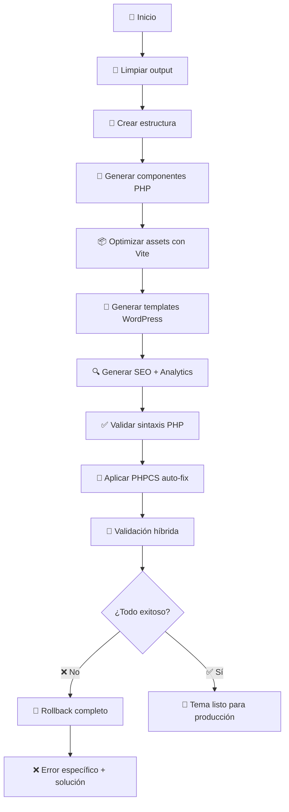

# 🎨 Toulouse Design System

**Sistema de diseño moderno con generación automática de temas WordPress de calidad profesional**

## 🚀 Características Principales

- ✅ **Componentes Lit** modernos y reutilizables
- ✅ **Generación automática** de temas WordPress desde componentes
- ✅ **AssetManager modernizado** - Delega optimización a Vite (minificación, tree-shaking, cache-busting)
- ✅ **Validación híbrida profesional** - PHPCS + Lighthouse + validaciones específicas de managers
- ✅ **Fail-fast approach** - Sin fallbacks silenciosos, rollback automático completo
- ✅ **WordPress Best Practices** - PHPCS integrado con WordPress Coding Standards
- ✅ **Calidad garantizada** - Solo genera código que pasa todas las validaciones
- ✅ **Validación de renderizado** - Verifica consistencia entre metadata.json y page-templates.json
- ✅ **Sistema de extensiones** - Hooks personalizables para analytics y funcionalidades avanzadas

## 📋 Comandos Principales

### 🚀 **Generación de Tema**
```bash
npm run wp:generate           # Generación completa con PHPCS y validaciones
npm run wp:generate:debug     # Generación con logs detallados (DEBUG_MODE=true)
npm run wp:generate:fast      # Generación rápida sin PHPCS (SKIP_PHPCS=true)
```

### 🔧 **Setup Inicial**
```bash
npm install                   # Instala dependencias (incluye Lighthouse)
npm run setup                 # Instala Composer + PHPCS WordPress Standards
npm run setup:composer        # Solo instalar Composer
npm run setup:phpcs          # Solo instalar PHPCS + WordPress Standards
```

### 🧪 **Validación y Calidad con Reportes Detallados**
```bash
npm run wp:validate           # Validación offline con reportes específicos
npm run wp:validate:render    # Solo validación de componentes
npm run wp:test-urls          # Test URLs en WordPress vivo con detalles
npm run wp:lint               # WordPress Coding Standards (PHPCS)
npm run wp:lint:fix           # Auto-fix PHPCS
npm run phpcs                 # PHPCS directo
npm run phpcs:fix             # PHPCBF directo
```

**📊 Los comandos de validación ahora muestran detalles específicos:**
- **Errores específicos**: Meta tags faltantes, problemas de sintaxis
- **Warnings con contexto**: Recomendaciones SEO, optimizaciones
- **Contadores claros**: `seo: WARN (3 errors, 19 warnings)`
- **Límite de detalles**: Primeros 5 errores, primeras 3 warnings

### 📚 **Desarrollo de Componentes**
```bash
npm run dev                   # Vite dev server
npm run build                 # Build para producción
npm run storybook             # Documentación interactiva
npm run build-storybook       # Build de Storybook
```

### 📚 **Storybook Stories - Single Source of Truth**
```bash
# Stories generation usando SOLO metadata.json como fuente única
npm run stories:generate:robust                    # Generar para todos los componentes
npm run storybook                                  # Ver documentación interactiva
npm run build-storybook                            # Build documentación para producción

# CLI avanzado para componentes específicos
npm run stories:single [componente]                        # Script npm (más fácil)
node src/storybook/generate-stories-robust.js [componente]  # Comando directo
node src/storybook/generate-stories-robust.js --help       # Ver ayuda completa
```

**🎯 CLI Parameters:**
```bash
# Generar story para componente específico (con backup automático)
npm run stories:single hero-section        # Script npm (recomendado)
npm run stories:single course-card         # Más fácil de recordar
node src/storybook/generate-stories-robust.js hero-section  # Comando directo

# Generar para todos los componentes sin stories
npm run stories:generate:robust
node src/storybook/generate-stories-robust.js

# Mostrar ayuda completa
node src/storybook/generate-stories-robust.js --help
```

**🎯 Características del nuevo generador:**
- ✅ **Single source of truth**: Solo usa `metadata.json` via ConfigSingleton
- ❌ **Sin extracción JavaScript**: No lee properties de archivos .js
- ✅ **Fail-fast estricto**: Error claro si componente no está en metadata
- ✅ **Mocks personalizados**: Soporta archivos `.mocks.js` opcionales
- ✅ **Backup automático**: Crea `.backup` antes de sobrescribir stories existentes
- ✅ **Componente específico**: Regenera solo el componente que necesites

## 🏗️ Arquitectura Modernizada - Single Source of Truth

### **🎯 Nueva Arquitectura Refactorizada (2024)**

**Separación de responsabilidades optimizada:**

- **`metadata.json`**: Solo metadatos de componentes (escape, parameters, arrayFields)
- **`page-templates.json`**: WordPress data completo (postTypes, queries, mappings, SEO)
- **ConfigSingleton**: Fuente única de verdad centralizada sin cache

## 🎨 ARQUITECTURA CSS HÍBRIDA CRÍTICA

### **⚠️ REGLAS OBLIGATORIAS CSS - PERFORMANCE CRÍTICA**

**🚨 NUNCA hacer esto:**
```javascript
// ❌ PROHIBIDO: Inline styles en componentes Lit
static styles = css`
  .hero { background: blue; padding: 20px; }
`;
```

**✅ SIEMPRE hacer esto:**
```javascript
// ✅ CORRECTO: CSS en archivos separados
import { LitElement, html, css } from 'lit';
import './hero-section.css'; // Para desarrollo individual

export class HeroSection extends LitElement {
  static styles = css``; // Vacío - estilos en archivo separado
}
```

### **🎯 Arquitectura CSS Híbrida Optimizada:**

**1. Para WordPress (Performance Crítica):**
- **`src/main.css`** - Archivo unificado con TODOS los componentes
- **Vite build** - Optimiza, minifica, tree-shaking automático
- **Core Web Vitals** - Un solo archivo CSS para máximo rendimiento

**2. Para Storybook (Documentación):**
- **`.storybook/preview.js`** - Importa `main.css` globalmente
- **Estilos unificados** - Todos los componentes se ven correctamente

**3. Para Desarrollo Individual:**
- **`component.css`** - Archivos separados para cada componente
- **Import individual** - `import './component.css'` en cada .js

### **📋 Flujo OBLIGATORIO para nuevos componentes:**

```bash
# 1. Crear componente con CSS separado
mkdir src/components/mi-componente
touch src/components/mi-componente/mi-componente.js
touch src/components/mi-componente/mi-componente.css   # ← OBLIGATORIO

# 2. Agregar import en main.css (CRÍTICO PARA PERFORMANCE)
echo "@import './components/mi-componente/mi-componente.css';" >> src/main.css

# 3. Importar CSS en componente Lit
echo "import './mi-componente.css';" >> src/components/mi-componente/mi-componente.js
```

**🔥 Si no sigues este flujo:**
- ❌ WordPress tendrá CSS no optimizado
- ❌ Storybook no mostrará estilos
- ❌ Core Web Vitals degradados
- ❌ Performance WordPress comprometida

### Estructura Actual

```
toulouse-design-system/
├── src/
│   ├── components/           # Componentes Lit
│   │   ├── hero-section/
│   │   ├── course-card/
│   │   ├── testimonials/
│   │   ├── feature-grid/
│   │   ├── interactive-gallery/
│   │   └── test-showcase/
│   ├── tokens/
│   │   └── design-tokens.css # Variables CSS centralizadas
│   ├── storybook/            # 📚 Generadores de Storybook
│   │   ├── generate-stories.js
│   │   ├── generate-stories-robust.js
│   │   └── test-story-generator.js
│   ├── extensions/           # 🧩 Sistema de extensiones
│   │   ├── test-extension.js
│   │   ├── conditional-logic-example.js
│   │   └── events-and-interactions-example.js
│   ├── metadata.json         # 🎯 SOLO: Metadata de componentes (escape, parameters)
│   ├── page-templates.json   # 🎯 TODO: WordPress (postTypes, queries, SEO)
│   └── index.js             # Entry point
├── scripts/
│   ├── config/
│   │   └── generate-wp-templates.js    # Entry point principal
│   ├── validation/          # 🔍 Sistema de validación unificado
│   │   ├── core/           # Base de validación
│   │   │   ├── validator-interface.js   # Interfaz común
│   │   │   ├── validation-engine.js     # Motor de validación
│   │   │   └── validation-result.js     # Estructuras de datos
│   │   ├── cli/            # CLIs de validación
│   │   │   ├── validate-offline.js     # Validación sin HTML
│   │   │   └── validate-live.js        # Validación WordPress live
│   │   ├── sources/        # Fuentes de datos
│   │   │   └── html-source.js          # Source HTML para live validation
│   │   └── validators/     # Validators específicos
│   │       ├── metadata-validator.js   # Babel AST + escape validation
│   │       ├── php-validator.js        # PHPCS + sintaxis PHP
│   │       ├── structure-validator.js  # Estructura de archivos
│   │       ├── component-validator.js  # Renderizado componentes
│   │       ├── seo-validator.js        # SEO + meta tags
│   │       └── asset-validator.js      # CSS, JS, assets
│   └── wp-generator/        # 🎯 Sistema de generación WordPress
│       ├── core/            # 🎯 ConfigSingleton - Single Source of Truth
│       │   └── config-singleton.js    # ConfigSingleton (NO CACHE)
│       ├── managers/        # Gestores especializados
│       │   ├── asset-manager.js        # Assets optimizados (Vite)
│       │   ├── analytics-manager.js    # GA4 + eventos separado
│       │   ├── seo-editable-manager.js # SEO dinámico + ACF editable
│       │   ├── component-generator.js  # 🎯 Lit → PHP (usa ConfigSingleton)
│       │   ├── template-builder.js     # Templates WordPress
│       │   ├── theme-structure.js      # Estructura del tema
│       │   └── acf-manager.js          # ACF fields automáticos
│       ├── templates/       # Generadores de código
│       │   ├── php-components.js       # PHP components
│       │   ├── functions-template.js   # 🎯 functions.php (usa ConfigSingleton)
│       │   ├── babel-ast-converter.js  # AST Lit→PHP + escape automático
│       │   ├── wp-templates.js         # Templates base WordPress
│       │   └── dynamic-page-templates.js # Templates dinámicos
│       └── extensions/      # 🧩 Sistema de extensiones
│           ├── extension-manager.js    # Gestor de extensiones + hooks
│           └── analytics/              # Extensiones Analytics
│               ├── ga4-data-layer.js
│               ├── facebook-pixel.js
│               └── custom-events.js
├── wordpress-output/        # Tema WordPress generado (con calidad)
│   └── toulouse-lautrec/   # Tema final con estructura correcta
│       ├── assets/         # Assets optimizados por Vite
│       │   ├── css/       # CSS + design-tokens
│       │   └── js/        # JavaScript optimizado
│       ├── components/    # Componentes PHP generados
│       ├── inc/          # Archivos de inclusión
│       │   ├── seo-manager.php
│       │   ├── analytics-manager.php
│       │   └── asset-enqueue.php
│       ├── functions.php # WordPress functions
│       ├── style.css    # WordPress theme info
│       └── page-*.php   # Templates de página
└── composer.phar          # Auto-instalado si es necesario
```

## 🔧 Flujo de Generación Completo

### `npm run wp:generate` - El Comando Definitivo



### Criterios de Éxito Estrictos

- ✅ **Sintaxis PHP 100% válida** (php -l)
- ✅ **PHPCS auto-fix exitoso** (14,000+ errores corregidos)
- ✅ **Validación híbrida EXCELLENT** (100% managers)
- ✅ **Assets optimizados funcionando** (CSS, JS, Tokens)
- ✅ **Dependencias verificadas** (Composer, Lighthouse)

## 🧩 Componentes Disponibles

### Componentes Principales

- **`hero-section`** - Sección hero con CTA
- **`course-card`** - Tarjetas de cursos
- **`testimonials`** - Sistema de testimonios con ratings
- **`feature-grid`** - Grid de características
- **`interactive-gallery`** - Galería interactiva
- **`test-showcase`** - Componente de prueba para validaciones

### 🧠 Generación Babel AST: Lit → PHP

Cada componente Lit se convierte automáticamente a PHP usando **Babel AST** con:

- ✅ **Escape automático** basado en metadata declarativa
- ✅ **Context tracking** para variables de scope
- ✅ **Fail-fast validation** sin fallbacks silenciosos
- ✅ **WordPress Coding Standards** aplicados automáticamente

```javascript
// Lit Component (src/components/hero-section/hero-section.js)
render() {
  return html`
    <section class="hero">
      <h1>${this.title}</h1>
      <p>${this.description}</p>
      <a href="${this.link}">${this.linkText}</a>
    </section>
  `;
}
```

```php
<?php
// PHP generado con escape automático (wordpress-output/toulouse-lautrec/components/hero-section/hero-section.php)
function render_hero_section($title = '', $description = '', $link = '', $linkText = '') {
    ?>
    <section class="hero">
      <h1><?php echo esc_html($title); ?></h1>
      <p><?php echo esc_html($description); ?></p>
      <a href="<?php echo esc_url($link); ?>"><?php echo esc_html($linkText); ?></a>
    </section>
    <?php
}
?>
```

## 🧩 Tipos de Componentes y Configuración

### **1. Static Components**
> Contenido fijo definido en configuración

```json
{
  "name": "hero-section",
  "props": {
    "title": "Bienvenidos",
    "subtitle": "Descubre tu potencial creativo",
    "ctaText": "Comenzar"
  }
}
```

### **2. Iterative Components**
> Bucles simples sobre colecciones WordPress

**Configuración en `page-templates.json`:**
```json
{
  "page-carreras": {
    "components": [
      {
        "name": "course-card",
        "dataSource": {
          "type": "post",
          "postType": "carrera",
          "query": {
            "numberposts": -1,
            "post_status": "publish"
          },
          "mapping": {
            "title": { "source": "post_title", "type": "native" },
            "description": { "source": "post_excerpt", "type": "native" },
            "image": { "source": "post_thumbnail_url", "type": "native" },
            "link": { "source": "post_permalink", "type": "native" },
            "linkText": { "source": "Ver carrera", "type": "static" }
          }
        }
      }
    ]
  },
  "postTypes": {
    "carrera": {
      "labels": { "name": "Carreras", "singular_name": "Carrera" },
      "public": true,
      "supports": ["title", "editor", "thumbnail", "excerpt"],
      "show_in_rest": true
    }
  }
}
```

### **3. Aggregated Components**
> Datos complejos con ACF, agregación avanzada

**Configuración en `page-templates.json`:**
```json
{
  "page-carreras": {
    "components": [
      {
        "name": "testimonials",
        "props": {
          "title": "Lo que dicen nuestros estudiantes",
          "subtitle": "Testimonios de éxito de nuestros egresados"
        },
        "dataSource": {
          "type": "post",
          "postType": "testimonio",
          "query": {
            "numberposts": 6,
            "post_status": "publish"
          },
          "mapping": {
            "name": { "source": "post_title", "type": "native" },
            "role": { "source": "meta_role", "type": "acf" },
            "content": { "source": "post_content", "type": "native" },
            "rating": { "source": "meta_rating", "type": "acf" },
            "user_photo": { "source": "meta_user_photo", "type": "acf" },
            "course": { "source": "meta_course", "type": "acf" }
          }
        }
      }
    ]
  },
  "postTypes": {
    "testimonio": {
      "labels": { "name": "Testimonios", "singular_name": "Testimonio" },
      "public": true,
      "supports": ["title", "editor", "thumbnail", "excerpt"],
      "show_in_rest": true
    }
  }
}
```

### **🎯 Nueva Separación de Responsabilidades (Refactorizada)**

- **`metadata.json`**: Define escape y estructura de componentes (parameters, arrayFields, escape metadata)
- **`page-templates.json`**: Define TODO lo de WordPress (postTypes, queries, mappings, SEO, props)
- **ConfigSingleton**: Single source of truth sin cache - lee ambos archivos fresh
- **Component-Generator**: Usa ConfigSingleton para combinar metadata + dataSource

### **🏗️ Ventajas de la Arquitectura Refactorizada:**

✅ **Cohesión contextual**: postTypes donde se usan
✅ **Single source por dominio**: WordPress data en un solo archivo
✅ **Mantenibilidad**: Cambios visibles en contexto
✅ **Escalabilidad**: Fácil agregar nuevos postTypes por página
✅ **No redundancia**: Eliminada duplicación de definiciones

## ⚙️ Configuración

### **🎯 Archivos de Configuración Refactorizados**

1. **`scripts/wp-generator/core/config-singleton.js`** - Single source of truth centralizada
2. **`src/metadata.json`** - SOLO metadata de componentes (escape, parameters, arrayFields)
3. **`src/page-templates.json`** - TODO WordPress (postTypes, queries, mappings, SEO, props)

**📋 Ejemplo de separación clara:**

**`src/metadata.json` - Solo metadatos de componentes:**
```json
{
  "course-card": {
    "type": "iterative",
    "parameters": [
      { "name": "title", "type": "string", "escape": "html" },
      { "name": "description", "type": "string", "escape": "html" },
      { "name": "image", "type": "string", "escape": "url" },
      { "name": "link", "type": "string", "escape": "url" },
      { "name": "linkText", "type": "string", "escape": "html" }
    ]
  }
}
```

**`src/page-templates.json` - TODO WordPress:**
```json
{
  "postTypes": {
    "carrera": {
      "labels": { "name": "Carreras" },
      "public": true,
      "supports": ["title", "editor", "thumbnail"]
    }
  },
  "page-carreras": {
    "components": [{
      "name": "course-card",
      "dataSource": {
        "postType": "carrera",
        "query": { "numberposts": -1 },
        "mapping": {
          "title": { "source": "post_title", "type": "native" }
        }
      }
    }]
  }
}
```

### Analytics + SEO Separados

```javascript
// config.js - Analytics separado de SEO
analytics: {
  googleAnalytics: {
    measurementId: 'G-ABC123DEF4',
    enabled: true
  },
  facebookPixel: {
    pixelId: '',
    enabled: false
  },
  customEvents: {
    pageViews: true,
    componentViews: true,
    interactions: true
  }
}
```

## 🔍 Sistema de Validación Híbrida

### Herramientas Profesionales Integradas

1. **PHPCS** - WordPress Coding Standards
2. **Lighthouse** - Performance, SEO, Accessibility
3. **Validaciones específicas** - Managers de funcionalidad

### Validaciones en Tiempo Real

- ✅ **Sintaxis PHP** - Validación inmediata
- ✅ **Estructura de archivos** - Verificación completa
- ✅ **Assets funcionando** - CSS, JS, Design Tokens
- ✅ **Managers operativos** - SEO, Analytics, Templates
- ✅ **URLs responsivas** - Test en WordPress vivo

## 📦 Despliegue y Uso

### Para Desarrolladores Nuevos

```bash
# 1. Clonar e instalar
git clone <repo>
cd toulouse-design-system
npm install

# 2. Setup automático (primera vez)
npm run setup

# 3. Generar tema WordPress con calidad profesional
npm run wp:generate

# 4. El tema estará listo en wordpress-output/toulouse-lautrec/
```

## 🔄 **Workflow Completo: Storybook → WordPress Deploy**

### **Paso 1: Desarrollo de Componentes**
```bash
# 1.1 Iniciar entorno de desarrollo
npm run dev                # Vite dev server (componentes Lit)
npm run storybook          # Documentación interactiva en puerto 6006

# 1.2 Crear/editar componente
# Editar: src/components/mi-componente/mi-componente.js
# Verificar en: http://localhost:6006
```

### **Paso 2: Configurar Metadata y Templates (Nueva Arquitectura)**

**🎯 2.1 Configurar SOLO metadatos en `src/metadata.json`:**
```json
{
  "mi-componente": {
    "type": "aggregated",
    "parameters": [
      { "name": "titulo", "type": "string", "escape": "html" },
      { "name": "imagen", "type": "string", "escape": "url" }
    ],
    "arrayFields": {
      "items": [
        { "name": "titulo", "type": "string", "fieldType": "text", "escape": "html" },
        { "name": "imagen", "type": "string", "fieldType": "image", "escape": "url" }
      ]
    }
  }
}
```

**🎯 2.2 Configurar TODO WordPress en `src/page-templates.json`:**
```json
{
  "postTypes": {
    "mi_post_type": {
      "labels": { "name": "Mi Post Type", "singular_name": "Mi Item" },
      "public": true,
      "supports": ["title", "editor", "thumbnail"]
    }
  },
  "page-ejemplo": {
    "file": "page-ejemplo.php",
    "title": "Mi Página",
    "seo": {
      "title": "Mi Página | Mi Sitio",
      "description": "Descripción de mi página"
    },
    "components": [{
      "name": "mi-componente",
      "props": {
        "titulo": "Mi Título Estático"
      },
      "dataSource": {
        "type": "post",
        "postType": "mi_post_type",
        "query": {
          "numberposts": -1,
          "post_status": "publish"
        },
        "mapping": {
          "titulo": { "source": "post_title", "type": "native" },
          "imagen": { "source": "meta_imagen", "type": "acf" }
        }
      }
    }]
  }
}
```

**💡 Ventajas de la separación:**
- ✅ **Cohesión**: postTypes donde se usan
- ✅ **Mantenibilidad**: Un cambio, un archivo
- ✅ **Escalabilidad**: Fácil agregar páginas con sus postTypes
- ✅ **Single source**: No duplicación de definiciones

### **Paso 3: Generar Stories - Single Source of Truth**

**🎯 Nuevo sistema de generación que usa SOLO metadata.json como fuente única:**

```bash
# 3.1 Generar stories desde metadata.json (recomendado)
npm run stories:generate:robust

# 3.2 Ver stories en Storybook
npm run storybook              # http://localhost:6006
```

**✨ Ventajas del nuevo generador:**
- ✅ **Zero duplication**: Una sola fuente para properties (metadata.json)
- ✅ **Fail-fast**: Error claro si componente falta en metadata
- ✅ **Consistent**: Mismo data source para PHP y Storybook
- ✅ **Clean**: No extrae properties de archivos JavaScript

**📋 Flujo de Stories Generation:**

```mermaid
graph TD
    A[🎯 ConfigSingleton.getMetadata\(\)] --> B[📄 Lee metadata.json]
    B --> C[🔍 Busca componentes sin stories]
    C --> D[⚡ FAIL-FAST: Componente en metadata?]
    D -->|❌ No| E[💥 Error: Componente no encontrado en metadata]
    D -->|✅ Sí| F[📝 Genera story con parameters exactos]
    F --> G[🔧 Aplica controls basados en types]
    G --> H[📦 Crea Template con property assignments]
    H --> I[🎨 Genera variantes si existen mocks]
    I --> J[✅ Story listo en Storybook]
```

**🧩 Estructura de archivos generados:**

```
src/components/mi-componente/
├── mi-componente.js           # Componente Lit original
├── mi-componente.stories.js   # 📚 Generado automáticamente
├── mi-componente.mocks.js     # 📦 Opcional: datos personalizados
└── mi-componente.css          # Estilos separados
```

**📦 Ejemplo de mock personalizado:**
```javascript
// src/components/course-card/course-card.mocks.js
module.exports = {
  defaultArgs: {
    title: 'Diseño UX/UI Avanzado',
    description: 'Aprende diseño centrado en usuario',
    price: 'S/ 299.00',
    featured: true
  },
  variants: {
    premium: {
      title: 'Curso Premium',
      price: 'S/ 599.00',
      badge: 'Premium'
    },
    free: {
      title: 'Curso Gratuito',
      price: 'Gratis',
      featured: false
    }
  }
};
```

**⚠️ Fail-Fast en acción:**
```bash
❌ FAIL FAST: Componente 'new-component' no encontrado en metadata.json
💡 Solución: Agregar 'new-component' a src/metadata.json con sus parameters
```

### **Paso 4: Generar Tema WordPress**
```bash
# 4.1 Generación completa con validaciones
npm run wp:generate

# 4.2 O con opciones específicas
npm run wp:generate:debug       # Con logs detallados
npm run wp:generate:fast        # Sin PHPCS (desarrollo rápido)
```

### **Paso 5: Validar Calidad**
```bash
# 5.1 Validación híbrida completa
npm run wp:validate

# 5.2 Validaciones específicas
npm run wp:validate:render      # Solo renderizado
npm run wp:lint                 # Solo PHPCS
npm run wp:test-urls           # URLs WordPress
```

### **Paso 6: Deploy en WordPress**
```bash
# 6.1 Copiar tema generado
cp -r wordpress-output/toulouse-lautrec /path/to/wordpress/wp-content/themes/

# 6.2 Activar en WordPress Admin
# Ve a: Apariencia > Temas > Activar "Toulouse Lautrec"

# 6.3 Verificar custom post types y ACF fields
# Se auto-crean según configuración en metadata.json
```

### **Paso 7: Testing en WordPress**
```bash
# 7.1 URLs disponibles tras activación:
# /carreras/        - Lista componentes course-card
# /contacto/        - Página estática
# /test-showcase/   - Validación completa

# 7.2 Verificar datos dinámicos
# Crear posts del tipo configurado en wp-admin
# Los componentes mostrarán datos reales automáticamente
```

### **🔄 Flujo Completo: Desarrollo → Storybook → WordPress**

**📋 Ciclo iterativo recomendado:**

```bash
# 1. DESARROLLO: Crear/modificar componente
npm run dev                  # Vite dev server para componentes Lit

# 2. DOCUMENTAR: Actualizar metadata y generar stories
# Editar src/metadata.json con parameters del componente
npm run stories:generate:robust  # Generar stories automáticamente
npm run storybook               # Verificar documentación (puerto 6006)

# 3. CONFIGURAR: Setup WordPress data
# Editar src/page-templates.json con postTypes y mappings

# 4. GENERAR: Crear tema WordPress
npm run wp:generate             # Generación completa con validaciones

# 5. DESPLEGAR: Probar en WordPress
# Copiar tema y activar en WordPress
# Refresh browser para ver cambios

# 6. VALIDAR: Testing completo
npm run wp:test-urls           # URLs específicas
npm run wp:validate            # Calidad completa
```

**💡 Tips para flujo eficiente:**

```bash
# Desarrollo rápido (skip validaciones)
npm run wp:generate:fast

# Solo regenerar stories tras cambios de metadata
npm run stories:generate:robust

# Ver logs detallados de generación
DEBUG_MODE=true npm run wp:generate

# Validar solo componente específico
npm run wp:validate:render
```

**🔄 Flujo específico por tipo de cambio:**

| Cambio | Comandos necesarios |
|--------|-------------------|
| **Nuevo componente** | `metadata.json` → `stories:generate:robust` → `wp:generate` |
| **Cambio UI/CSS** | `npm run dev` → `npm run wp:generate` |
| **Cambio data** | `page-templates.json` → `npm run wp:generate` |
| **Cambio properties** | `metadata.json` → `node generate-stories-robust.js [componente]` → `wp:generate` |
| **Solo documentation** | `node generate-stories-robust.js [componente]` → `npm run storybook` |
| **Regenerar story específico** | `node generate-stories-robust.js [componente]` (con backup automático) |

### **🐛 Troubleshooting para Developers**

**🧩 Errores de Stories Generation:**

**❌ Error: "Componente 'X' no encontrado en metadata.json"**
```bash
# Solución: Agregar componente a metadata.json
# Ejemplo:
{
  "mi-componente": {
    "type": "static",
    "parameters": [
      { "name": "title", "type": "string", "default": "", "escape": "html" }
    ]
  }
}
```

**❌ Error: "Sin parameters en metadata.json"**
```bash
# Solución: Verificar que el componente tenga parameters definidos
# NO puede estar vacío - debe tener al menos un parameter
```

**❌ Stories generado pero sin controls en Storybook**
```bash
# Solución: Verificar types en metadata.json son válidos
# Tipos válidos: string, number, boolean, array, object
# El generador mapea automáticamente a Storybook controls
```

**❌ Error: "Todos los componentes ya tienen stories"**
```bash
# Opción 1: Usar CLI para componente específico (recomendado - con backup)
node src/storybook/generate-stories-robust.js mi-componente

# Opción 2: Eliminar manualmente y regenerar
rm src/components/mi-componente/mi-componente.stories.js
npm run stories:generate:robust
```

**💡 Uso avanzado del CLI:**
```bash
# Regenerar múltiples componentes específicos
node src/storybook/generate-stories-robust.js hero-section
node src/storybook/generate-stories-robust.js course-card
node src/storybook/generate-stories-robust.js testimonials

# Ver todas las opciones disponibles
node src/storybook/generate-stories-robust.js --help
```

**🎨 Errores de CSS Architecture:**

**❌ Error: "Componente no tiene estilos en Storybook"**
```bash
# Verificar que main.css incluya el componente
grep "mi-componente" src/main.css

# Si no está, agregarlo:
echo "@import './components/mi-componente/mi-componente.css';" >> src/main.css

# Reiniciar Storybook
npm run storybook
```

**❌ Error: "Estilos no se aplican en WordPress"**
```bash
# Verificar que main.css se construya correctamente
npm run build

# Verificar que WordPress enqueue el CSS unificado (no individual)
# El generador WordPress debe usar dist/css/toulouse-design-system-*.css
```

**❌ Error: "Developer usó inline styles"**
```bash
# Buscar violaciones críticas
grep -r "static styles.*css\`" src/components/
# Si encuentra algo, mover a archivos .css separados INMEDIATAMENTE
```

**💡 Validación CSS obligatoria antes de deploy:**
```bash
# 1. Verificar que no hay inline styles
npm run lint:css-architecture  # (crear este script si es necesario)

# 2. Verificar que main.css incluye todos los componentes
find src/components -name "*.css" | wc -l  # Contar CSS files
grep -c "@import.*components" src/main.css # Contar imports en main.css
# Los números deben coincidir
```

**🎯 Errores WordPress Generation:**

**❌ Error: "fieldTypes is not defined"**
```bash
# Solución: Verificar metadata.json tiene arrayFields definidos
# Regenerar con debug para ver logs
npm run wp:generate:debug
```

**❌ Error: "src="45" en lugar de URL de imagen"**
```bash
# Solución: Campo image debe tener fieldType: "image" en metadata.json
# El sistema auto-convierte IDs a URLs
```

**❌ Error: "Componente no renderiza datos"**
```bash
# 1. Verificar names exactos entre Lit y page-templates.json
# 2. Verificar dataSource mapping correcto
# 3. Usar validación de renderizado:
npm run wp:validate:render
```

**❌ Error: "PHPCS fallando"**
```bash
# Auto-fix disponible:
npm run wp:lint:fix
# O skip para desarrollo rápido:
npm run wp:generate:fast
```

### **💡 Tips para Developers**

**🚀 Desarrollo Rápido:**
```bash
# Skip validaciones para iteración rápida
npm run wp:generate:fast

# Solo regenerar un componente específico
# (editar src/page-templates.json para incluir solo ese componente)
```

**🔍 Debug Avanzado:**
```bash
# Logs detallados de generación
DEBUG_MODE=true npm run wp:generate

# Ver estructura generada
ls -la wordpress-output/toulouse-lautrec/

# Verificar sintaxis PHP individual
php -l wordpress-output/toulouse-lautrec/components/mi-componente/mi-componente.php
```

**📋 Validación Granular:**
```bash
# Solo validar managers específicos
npm run wp:validate

# Solo validar URLs específicas
npm run wp:test-urls

# Solo validar renderizado
npm run wp:validate:render
```

## 🎯 WordPress Best Practices

### 🔒 Sistema de Escape Metadata-Driven

El sistema usa metadata declarativa para aplicar escape automático:

```json
// src/metadata.json - Configuración de escape
{
  "hero-section": {
    "parameters": [
      { "name": "title", "type": "string", "escape": "html" },
      { "name": "link", "type": "string", "escape": "url" },
      { "name": "linkText", "type": "string", "escape": "html" }
    ],
    "arrayFields": {
      "features": [
        { "name": "icon", "type": "string", "fieldType": "text", "escape": "html" },
        { "name": "url", "type": "string", "fieldType": "url", "escape": "url" }
      ]
    }
  }
}
```

### 🚨 Fail-Fast: Sin Fallbacks

- ✅ **Metadata obligatoria**: Si falta escape metadata, el generador falla
- ❌ **Sin fallbacks**: No hay código que "adivine" el tipo de escape
- ✅ **Errores claros**: Mensajes específicos indican qué metadata falta
- ✅ **Rollback automático**: Limpieza completa si algo falla

### Seguridad y Escapado
- ✅ `esc_html()` para texto (declarado en metadata)
- ✅ `esc_url()` para URLs (declarado en metadata)
- ✅ `esc_attr()` para atributos (declarado en metadata)
- ✅ `wp_kses_post()` para contenido rico (cuando necesario)

### Internacionalización
- ✅ `__()` y `_e()` para todos los textos
- ✅ Text domain consistente
- ✅ Sin strings hardcodeados

## 🚀 WordPress Deployment

### **Instalación del Tema**

1. **Copia el tema generado:**
   ```bash
   cp -r wordpress-output/toulouse-lautrec /path/to/wordpress/wp-content/themes/
   ```

2. **Activa el tema en WordPress Admin:**
   - Ve a `Apariencia > Temas`
   - Activa "Toulouse Lautrec"

### **Configuración de Custom Post Types**

El tema incluye ACF fields automáticamente. Para usar los custom post types:

```php
// Se auto-registran: carrera, testimonio
// ACF fields se auto-crean según metadata.json
```

### **URLs de Prueba**

Una vez instalado, estas páginas estarán disponibles:
- `/carreras/` - Lista de carreras con course-cards
- `/contacto/` - Página de contacto
- `/test-showcase/` - Validación de todos los managers

### Estructura WordPress
- ✅ `get_template_part()` en lugar de `require`
- ✅ `wp_enqueue_script()` y `wp_enqueue_style()`
- ✅ Hooks y filtros apropiados
- ✅ Nonce de seguridad para formularios

## 🛠️ Troubleshooting

### Errores Comunes

**❌ Composer no encontrado**
```bash
npm run setup:composer
```

**❌ Lighthouse faltante**
```bash
npm install  # Ya incluido en devDependencies
```

**❌ PHPCS errores**
```bash
npm run wp:lint:fix  # Auto-corrección
```

### Estados de Error vs Éxito

- **✅ ÉXITO**: Solo si TODO funciona (fail-fast)
- **❌ ERROR**: Cualquier dependencia faltante o proceso fallido
- **🔄 ROLLBACK**: Limpieza automática completa

## 📚 Documentación Adicional

- **[TUTORIAL_END_TO_END.md](TUTORIAL_END_TO_END.md)** - Tutorial completo end-to-end
- **[CHANGELOG.md](CHANGELOG.md)** - Historial de cambios y mejoras

## 🧩 Gutenberg Blocks Implementation

### **Sistema de Bloques Robusto**

El sistema incluye un registro de bloques Gutenberg con **fail-fast y validación completa**:

```php
// ✅ Sistema con doble hook para asegurar ejecución
function toulouse_init_gutenberg_blocks() {
    // ✅ FAIL-FAST: Validación estricta
    if ( ! function_exists( 'register_block_type' ) ) {
        throw new Exception('❌ GUTENBERG NO DISPONIBLE');
    }

    toulouse_register_gutenberg_blocks();
}
add_action( 'init', 'toulouse_init_gutenberg_blocks' );

// ✅ FORZAR registro con hook adicional
function toulouse_force_register_blocks() {
    toulouse_register_gutenberg_blocks();
}
add_action( 'wp_loaded', 'toulouse_force_register_blocks' );
```

### **Características del Sistema de Bloques**

- ✅ **Auto-discovery**: Detecta automáticamente bloques en `/blocks/`
- ✅ **Validación JSON**: Verifica estructura `block.json` antes de registro
- ✅ **Doble Hook**: `init` + `wp_loaded` para asegurar ejecución
- ✅ **Fail-Fast**: Error claro si falta estructura requerida
- ✅ **Logging**: Reportes detallados de bloques registrados/fallidos

### **Componentes Generados como Bloques**

Todos los componentes Lit se convierten automáticamente a bloques Gutenberg:

- `tl/hero-section` → Bloque Hero Section
- `tl/course-card` → Bloque Course Card
- `tl/testimonials` → Bloque Testimonials
- `tl/feature-grid` → Bloque Feature Grid
- `tl/interactive-gallery` → Bloque Interactive Gallery

### **Uso en WordPress**

1. **Los bloques aparecen automáticamente** en el editor de WordPress
2. **Se registran en categoría "Toulouse Lautrec Theme"**
3. **Renderizado seguro** con escape automático via PHP
4. **Edición visual** con atributos configurables

## 🏆 Estado del Proyecto

**✅ PRODUCCIÓN-READY**
- Generación completamente automatizada
- Calidad profesional garantizada
- Validaciones estrictas integradas
- Dependencias auto-gestionadas
- Rollback automático en errores
- WordPress Coding Standards aplicados

---

**🎯 Un solo comando. Calidad profesional garantizada.**

`npm run wp:generate`