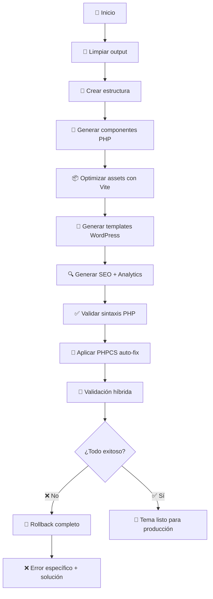

# 🎨 Toulouse Design System

**Sistema de diseño moderno con generación automática de temas WordPress de calidad profesional**

## 🚀 Características Principales

- ✅ **Componentes Lit** modernos y reutilizables
- ✅ **Generación automática** de temas WordPress desde componentes
- ✅ **AssetManager modernizado** - Delega optimización a Vite (minificación, tree-shaking, cache-busting)
- ✅ **Validación híbrida profesional** - PHPCS + Lighthouse + validaciones específicas de managers
- ✅ **Fail-fast approach** - Sin fallbacks silenciosos, rollback automático completo
- ✅ **WordPress Best Practices** - PHPCS integrado con WordPress Coding Standards
- ✅ **Calidad garantizada** - Solo genera código que pasa todas las validaciones

## 📋 Comandos Principales

```bash
# 🚀 Comando principal - Full workflow con calidad profesional
npm run wp:generate     # Genera tema + aplica PHPCS + valida todo

# 🔧 Setup inicial para nuevos desarrolladores
npm install             # Instala dependencias (incluye Lighthouse)
npm run setup           # Instala Composer + PHPCS WordPress Standards

# 🧪 Validaciones específicas
npm run wp:validate     # Validación híbrida completa
npm run wp:test-urls    # Test de URLs en WordPress vivo
npm run wp:lint         # Solo PHPCS
npm run wp:lint:fix     # Solo auto-fix PHPCS
```

## 🏗️ Arquitectura Modernizada

### Estructura Actual

```
toulouse-design-system/
├── src/
│   ├── components/           # Componentes Lit
│   │   ├── hero-section/
│   │   ├── course-card/
│   │   ├── testimonials/
│   │   ├── feature-grid/
│   │   ├── interactive-gallery/
│   │   └── test-showcase/
│   ├── tokens/
│   │   └── design-tokens.css # Variables CSS centralizadas
│   ├── metadata.json        # Metadata de componentes
│   ├── page-templates.json  # Configuración de páginas
│   └── index.js            # Entry point
├── scripts/
│   ├── config/
│   │   └── generate-wp-templates.js    # Entry point principal
│   ├── validation/
│   │   └── hybrid-validator.js         # Validador híbrido profesional
│   └── wp-generator/        # Sistema de generación WordPress
│       ├── core/            # Configuración central
│       │   ├── config.js               # Config dinámico con fail-fast
│       │   └── config-manager.js       # Gestor de configuración
│       ├── managers/        # Gestores especializados
│       │   ├── asset-manager.js        # Assets optimizados (Vite)
│       │   ├── analytics-manager.js    # GA4 + eventos separado
│       │   ├── seo-manager.js          # SEO dinámico puro
│       │   ├── component-generator.js  # Lit → PHP
│       │   ├── template-builder.js     # Templates WordPress
│       │   └── theme-structure.js      # Estructura del tema
│       ├── templates/       # Generadores de código
│       │   ├── php-components.js       # PHP components
│       │   ├── functions-template.js   # functions.php
│       │   └── dynamic-page-templates.js
│       ├── validation/      # Validación PHP + sintaxis
│       │   ├── validator.js            # Validador básico
│       │   ├── validation-manager.js   # Validaciones avanzadas
│       │   └── php-validator.js        # Validación PHP tiempo real
│       └── extensions/      # Sistema de extensiones
│           ├── extension-manager.js    # Gestor de extensiones
│           └── analytics/              # Extensiones Analytics
│               ├── ga4-data-layer.js
│               ├── facebook-pixel.js
│               └── custom-events.js
├── wordpress-output/        # Tema WordPress generado (con calidad)
│   └── toulouse-lautrec/   # Tema final con estructura correcta
│       ├── assets/         # Assets optimizados por Vite
│       │   ├── css/       # CSS + design-tokens
│       │   └── js/        # JavaScript optimizado
│       ├── components/    # Componentes PHP generados
│       ├── inc/          # Archivos de inclusión
│       │   ├── seo-manager.php
│       │   ├── analytics-manager.php
│       │   └── asset-enqueue.php
│       ├── functions.php # WordPress functions
│       ├── style.css    # WordPress theme info
│       └── page-*.php   # Templates de página
└── composer.phar          # Auto-instalado si es necesario
```

## 🔧 Flujo de Generación Completo

### `npm run wp:generate` - El Comando Definitivo



### Criterios de Éxito Estrictos

- ✅ **Sintaxis PHP 100% válida** (php -l)
- ✅ **PHPCS auto-fix exitoso** (14,000+ errores corregidos)
- ✅ **Validación híbrida EXCELLENT** (100% managers)
- ✅ **Assets optimizados funcionando** (CSS, JS, Tokens)
- ✅ **Dependencias verificadas** (Composer, Lighthouse)

## 🧩 Componentes Disponibles

### Componentes Principales

- **`hero-section`** - Sección hero con CTA
- **`course-card`** - Tarjetas de cursos
- **`testimonials`** - Sistema de testimonios con ratings
- **`feature-grid`** - Grid de características
- **`interactive-gallery`** - Galería interactiva
- **`test-showcase`** - Componente de prueba para validaciones

### Generación Automática Lit → PHP

Cada componente Lit se convierte automáticamente a PHP siguiendo las reglas de WordPress:

```javascript
// Lit Component (src/components/hero-section/hero-section.js)
render() {
  return html`
    <section class="hero">
      <h1>${this.title}</h1>
      <p>${this.description}</p>
    </section>
  `;
}
```

```php
<?php
// PHP generado (wordpress-output/toulouse-lautrec/components/hero-section/hero-section.php)
function render_hero_section($title = '', $description = '') {
    ?>
    <section class="hero">
      <h1><?php echo esc_html($title); ?></h1>
      <p><?php echo esc_html($description); ?></p>
    </section>
    <?php
}
?>
```

## ⚙️ Configuración

### Archivos de Configuración Principales

1. **`scripts/wp-generator/core/config.js`** - Configuración central
2. **`src/metadata.json`** - Metadata de componentes
3. **`src/page-templates.json`** - Configuración de páginas

### Analytics + SEO Separados

```javascript
// config.js - Analytics separado de SEO
analytics: {
  googleAnalytics: {
    measurementId: 'G-ABC123DEF4',
    enabled: true
  },
  facebookPixel: {
    pixelId: '',
    enabled: false
  },
  customEvents: {
    pageViews: true,
    componentViews: true,
    interactions: true
  }
}
```

## 🔍 Sistema de Validación Híbrida

### Herramientas Profesionales Integradas

1. **PHPCS** - WordPress Coding Standards
2. **Lighthouse** - Performance, SEO, Accessibility
3. **Validaciones específicas** - Managers de funcionalidad

### Validaciones en Tiempo Real

- ✅ **Sintaxis PHP** - Validación inmediata
- ✅ **Estructura de archivos** - Verificación completa
- ✅ **Assets funcionando** - CSS, JS, Design Tokens
- ✅ **Managers operativos** - SEO, Analytics, Templates
- ✅ **URLs responsivas** - Test en WordPress vivo

## 📦 Despliegue y Uso

### Para Desarrolladores Nuevos

```bash
# 1. Clonar e instalar
git clone <repo>
cd toulouse-design-system
npm install

# 2. Setup automático (primera vez)
npm run setup

# 3. Generar tema WordPress con calidad profesional
npm run wp:generate

# 4. El tema estará listo en wordpress-output/toulouse-lautrec/
```

### Para Desarrollo Continuo

```bash
# Desarrollo de componentes
npm run dev                # Vite dev server
npm run storybook          # Documentación

# Generación WordPress
npm run wp:generate        # Full workflow
npm run wp:validate        # Solo validación
npm run wp:test-urls       # Test URLs específicas
```

## 🎯 WordPress Best Practices

### Seguridad y Escapado
- ✅ `esc_html()` para texto
- ✅ `esc_url()` para URLs
- ✅ `esc_attr()` para atributos
- ✅ `wp_kses_post()` para contenido rico

### Internacionalización
- ✅ `__()` y `_e()` para todos los textos
- ✅ Text domain consistente
- ✅ Sin strings hardcodeados

### Estructura WordPress
- ✅ `get_template_part()` en lugar de `require`
- ✅ `wp_enqueue_script()` y `wp_enqueue_style()`
- ✅ Hooks y filtros apropiados
- ✅ Nonce de seguridad para formularios

## 🛠️ Troubleshooting

### Errores Comunes

**❌ Composer no encontrado**
```bash
npm run setup:composer
```

**❌ Lighthouse faltante**
```bash
npm install  # Ya incluido en devDependencies
```

**❌ PHPCS errores**
```bash
npm run wp:lint:fix  # Auto-corrección
```

### Estados de Error vs Éxito

- **✅ ÉXITO**: Solo si TODO funciona (fail-fast)
- **❌ ERROR**: Cualquier dependencia faltante o proceso fallido
- **🔄 ROLLBACK**: Limpieza automática completa

## 📚 Documentación Adicional

- **[CLAUDE.md](CLAUDE.md)** - Instrucciones específicas para Claude
- **[TUTORIAL_END_TO_END.md](TUTORIAL_END_TO_END.md)** - Tutorial completo
- **[WORDPRESS-DEPLOYMENT.md](WORDPRESS-DEPLOYMENT.md)** - Despliegue WordPress

## 🏆 Estado del Proyecto

**✅ PRODUCCIÓN-READY**
- Generación completamente automatizada
- Calidad profesional garantizada
- Validaciones estrictas integradas
- Dependencias auto-gestionadas
- Rollback automático en errores
- WordPress Coding Standards aplicados

---

**🎯 Un solo comando. Calidad profesional garantizada.**

`npm run wp:generate`