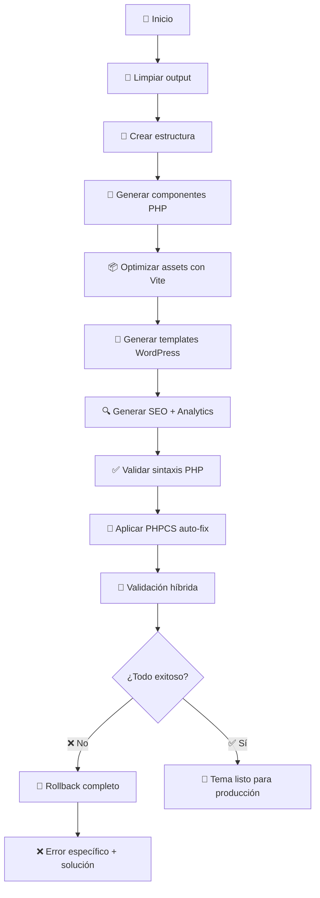

# 🎨 Toulouse Design System

**Sistema de diseño moderno con generación automática de temas WordPress de calidad profesional**

## 🚀 Características Principales

- ✅ **Componentes Lit** modernos y reutilizables
- ✅ **Generación automática** de temas WordPress desde componentes
- ✅ **AssetManager modernizado** - Delega optimización a Vite (minificación, tree-shaking, cache-busting)
- ✅ **Validación híbrida profesional** - PHPCS + Lighthouse + validaciones específicas de managers
- ✅ **Fail-fast approach** - Sin fallbacks silenciosos, rollback automático completo
- ✅ **WordPress Best Practices** - PHPCS integrado con WordPress Coding Standards
- ✅ **Calidad garantizada** - Solo genera código que pasa todas las validaciones
- ✅ **Validación de renderizado** - Verifica consistencia entre metadata.json y page-templates.json
- ✅ **Sistema de extensiones** - Hooks personalizables para analytics y funcionalidades avanzadas

## 📋 Comandos Principales

### 🚀 **Generación de Tema**
```bash
npm run wp:generate           # Generación completa con PHPCS y validaciones
npm run wp:generate:debug     # Generación con logs detallados (DEBUG_MODE=true)
npm run wp:generate:fast      # Generación rápida sin PHPCS (SKIP_PHPCS=true)
```

### 🔧 **Setup Inicial**
```bash
npm install                   # Instala dependencias (incluye Lighthouse)
npm run setup                 # Instala Composer + PHPCS WordPress Standards
npm run setup:composer        # Solo instalar Composer
npm run setup:phpcs          # Solo instalar PHPCS + WordPress Standards
```

### 🧪 **Validación y Calidad**
```bash
npm run wp:validate           # Validación híbrida completa
npm run wp:validate:render    # Solo validación de renderizado
npm run wp:test-urls          # Test URLs en WordPress vivo
npm run wp:lint               # WordPress Coding Standards (PHPCS)
npm run wp:lint:fix           # Auto-fix PHPCS
npm run phpcs                 # PHPCS directo
npm run phpcs:fix             # PHPCBF directo
```

### 📚 **Desarrollo de Componentes**
```bash
npm run dev                   # Vite dev server
npm run build                 # Build para producción
npm run storybook             # Documentación interactiva
npm run build-storybook       # Build de Storybook
```

### 🧩 **Storybook Stories**
```bash
npm run stories:generate      # Generar stories básicas
npm run stories:generate:robust # Generar stories robustas
npm run stories:test          # Test del generador de stories
```

## 🏗️ Arquitectura Modernizada

### Estructura Actual

```
toulouse-design-system/
├── src/
│   ├── components/           # Componentes Lit
│   │   ├── hero-section/
│   │   ├── course-card/
│   │   ├── testimonials/
│   │   ├── feature-grid/
│   │   ├── interactive-gallery/
│   │   └── test-showcase/
│   ├── tokens/
│   │   └── design-tokens.css # Variables CSS centralizadas
│   ├── extensions/         # 🧩 Sistema de extensiones
│   │   ├── test-extension.js           # Extensión de prueba/validación
│   │   ├── conditional-logic-example.js
│   │   └── events-and-interactions-example.js
│   ├── metadata.json        # Metadata de componentes + tipos
│   ├── page-templates.json  # Configuración de páginas + props
│   └── index.js            # Entry point
├── scripts/
│   ├── config/
│   │   └── generate-wp-templates.js    # Entry point principal
│   ├── validation/          # 🔍 Sistema de validación multinivel
│   │   ├── hybrid-validator.js         # Validador híbrido profesional
│   │   ├── component-render-validator.js # Validación renderizado componentes
│   │   ├── component-render-validator-cli.js # CLI standalone
│   │   ├── manager-validator.js        # Validación de managers
│   │   └── wordpress-url-tester.js     # Test URLs WordPress vivo
│   └── wp-generator/        # Sistema de generación WordPress
│       ├── core/            # Configuración central
│       │   ├── config.js               # Config dinámico con fail-fast
│       │   └── config-manager.js       # Gestor de configuración
│       ├── managers/        # Gestores especializados
│       │   ├── asset-manager.js        # Assets optimizados (Vite)
│       │   ├── analytics-manager.js    # GA4 + eventos separado
│       │   ├── seo-editable-manager.js  # SEO dinámico + ACF editable
│       │   ├── component-generator.js  # Lit → PHP + extensiones
│       │   ├── template-builder.js     # Templates WordPress
│       │   └── theme-structure.js      # Estructura del tema
│       ├── templates/       # Generadores de código
│       │   ├── php-components.js       # PHP components
│       │   ├── functions-template.js   # functions.php
│       │   └── dynamic-page-templates.js
│       ├── validation/      # Validación PHP + sintaxis
│       │   ├── validator.js            # Validador básico
│       │   ├── validation-manager.js   # Validaciones avanzadas
│       │   └── php-validator.js        # Validación PHP tiempo real
│       └── extensions/      # 🧩 Sistema de extensiones
│           ├── extension-manager.js    # Gestor de extensiones + hooks
│           └── analytics/              # Extensiones Analytics
│               ├── ga4-data-layer.js
│               ├── facebook-pixel.js
│               └── custom-events.js
├── wordpress-output/        # Tema WordPress generado (con calidad)
│   └── toulouse-lautrec/   # Tema final con estructura correcta
│       ├── assets/         # Assets optimizados por Vite
│       │   ├── css/       # CSS + design-tokens
│       │   └── js/        # JavaScript optimizado
│       ├── components/    # Componentes PHP generados
│       ├── inc/          # Archivos de inclusión
│       │   ├── seo-manager.php
│       │   ├── analytics-manager.php
│       │   └── asset-enqueue.php
│       ├── functions.php # WordPress functions
│       ├── style.css    # WordPress theme info
│       └── page-*.php   # Templates de página
└── composer.phar          # Auto-instalado si es necesario
```

## 🔧 Flujo de Generación Completo

### `npm run wp:generate` - El Comando Definitivo



### Criterios de Éxito Estrictos

- ✅ **Sintaxis PHP 100% válida** (php -l)
- ✅ **PHPCS auto-fix exitoso** (14,000+ errores corregidos)
- ✅ **Validación híbrida EXCELLENT** (100% managers)
- ✅ **Assets optimizados funcionando** (CSS, JS, Tokens)
- ✅ **Dependencias verificadas** (Composer, Lighthouse)

## 🧩 Componentes Disponibles

### Componentes Principales

- **`hero-section`** - Sección hero con CTA
- **`course-card`** - Tarjetas de cursos
- **`testimonials`** - Sistema de testimonios con ratings
- **`feature-grid`** - Grid de características
- **`interactive-gallery`** - Galería interactiva
- **`test-showcase`** - Componente de prueba para validaciones

### Generación Automática Lit → PHP

Cada componente Lit se convierte automáticamente a PHP siguiendo las reglas de WordPress:

```javascript
// Lit Component (src/components/hero-section/hero-section.js)
render() {
  return html`
    <section class="hero">
      <h1>${this.title}</h1>
      <p>${this.description}</p>
    </section>
  `;
}
```

```php
<?php
// PHP generado (wordpress-output/toulouse-lautrec/components/hero-section/hero-section.php)
function render_hero_section($title = '', $description = '') {
    ?>
    <section class="hero">
      <h1><?php echo esc_html($title); ?></h1>
      <p><?php echo esc_html($description); ?></p>
    </section>
    <?php
}
?>
```

## 🧩 Tipos de Componentes y Configuración

### **1. Static Components**
> Contenido fijo definido en configuración

```json
{
  "name": "hero-section",
  "props": {
    "title": "Bienvenidos",
    "subtitle": "Descubre tu potencial creativo",
    "ctaText": "Comenzar"
  }
}
```

### **2. Iterative Components**
> Bucles simples sobre colecciones WordPress

```json
{
  "name": "course-card",
  "dataSource": {
    "type": "post",
    "postType": "carrera",
    "query": { "numberposts": -1 },
    "mapping": {
      "title": { "source": "post_title", "type": "native" },
      "image": { "source": "post_thumbnail_url", "type": "native" }
    }
  }
}
```

### **3. Aggregated Components**
> Datos complejos con ACF, agregación avanzada

```json
{
  "name": "testimonials",
  "dataSource": {
    "type": "post",
    "postType": "testimonio",
    "mapping": {
      "user_photo": { "source": "meta_user_photo", "type": "acf" },
      "rating": { "source": "meta_rating", "type": "acf" }
    }
  }
}
```

### **🔄 Separación de Responsabilidades**

- **`metadata.json`** - Define QUÉ tipo de campo (`fieldType: "image"`)
- **`page-templates.json`** - Define DÓNDE viene el dato (`source: "meta_photo"`)
- **Manejo automático de imágenes** - Convierte IDs a URLs automáticamente

## ⚙️ Configuración

### Archivos de Configuración Principales

1. **`scripts/wp-generator/core/config.js`** - Configuración central
2. **`src/metadata.json`** - Metadata de componentes
3. **`src/page-templates.json`** - Configuración de páginas

### Analytics + SEO Separados

```javascript
// config.js - Analytics separado de SEO
analytics: {
  googleAnalytics: {
    measurementId: 'G-ABC123DEF4',
    enabled: true
  },
  facebookPixel: {
    pixelId: '',
    enabled: false
  },
  customEvents: {
    pageViews: true,
    componentViews: true,
    interactions: true
  }
}
```

## 🔍 Sistema de Validación Híbrida

### Herramientas Profesionales Integradas

1. **PHPCS** - WordPress Coding Standards
2. **Lighthouse** - Performance, SEO, Accessibility
3. **Validaciones específicas** - Managers de funcionalidad

### Validaciones en Tiempo Real

- ✅ **Sintaxis PHP** - Validación inmediata
- ✅ **Estructura de archivos** - Verificación completa
- ✅ **Assets funcionando** - CSS, JS, Design Tokens
- ✅ **Managers operativos** - SEO, Analytics, Templates
- ✅ **URLs responsivas** - Test en WordPress vivo

## 📦 Despliegue y Uso

### Para Desarrolladores Nuevos

```bash
# 1. Clonar e instalar
git clone <repo>
cd toulouse-design-system
npm install

# 2. Setup automático (primera vez)
npm run setup

# 3. Generar tema WordPress con calidad profesional
npm run wp:generate

# 4. El tema estará listo en wordpress-output/toulouse-lautrec/
```

## 🔄 **Workflow Completo: Storybook → WordPress Deploy**

### **Paso 1: Desarrollo de Componentes**
```bash
# 1.1 Iniciar entorno de desarrollo
npm run dev                # Vite dev server (componentes Lit)
npm run storybook          # Documentación interactiva en puerto 6006

# 1.2 Crear/editar componente
# Editar: src/components/mi-componente/mi-componente.js
# Verificar en: http://localhost:6006
```

### **Paso 2: Configurar Metadata y Templates**
```bash
# 2.1 Configurar tipo de componente en metadata.json
{
  "mi-componente": {
    "type": "aggregated",
    "arrayFields": [
      {"name": "titulo", "type": "string", "fieldType": "text"},
      {"name": "imagen", "type": "string", "fieldType": "image"}
    ]
  }
}

# 2.2 Configurar datos en page-templates.json
{
  "page-ejemplo": {
    "components": [{
      "name": "mi-componente",
      "dataSource": {
        "type": "post",
        "postType": "mi_post_type",
        "mapping": {
          "titulo": {"source": "post_title", "type": "native"},
          "imagen": {"source": "meta_imagen", "type": "acf"}
        }
      }
    }]
  }
}
```

### **Paso 3: Generar Stories (Opcional)**
```bash
npm run stories:generate         # Stories básicas
npm run stories:generate:robust  # Stories con datos complejos
npm run stories:test            # Verificar generador
```

### **Paso 4: Generar Tema WordPress**
```bash
# 4.1 Generación completa con validaciones
npm run wp:generate

# 4.2 O con opciones específicas
npm run wp:generate:debug       # Con logs detallados
npm run wp:generate:fast        # Sin PHPCS (desarrollo rápido)
```

### **Paso 5: Validar Calidad**
```bash
# 5.1 Validación híbrida completa
npm run wp:validate

# 5.2 Validaciones específicas
npm run wp:validate:render      # Solo renderizado
npm run wp:lint                 # Solo PHPCS
npm run wp:test-urls           # URLs WordPress
```

### **Paso 6: Deploy en WordPress**
```bash
# 6.1 Copiar tema generado
cp -r wordpress-output/toulouse-lautrec /path/to/wordpress/wp-content/themes/

# 6.2 Activar en WordPress Admin
# Ve a: Apariencia > Temas > Activar "Toulouse Lautrec"

# 6.3 Verificar custom post types y ACF fields
# Se auto-crean según configuración en metadata.json
```

### **Paso 7: Testing en WordPress**
```bash
# 7.1 URLs disponibles tras activación:
# /carreras/        - Lista componentes course-card
# /contacto/        - Página estática
# /test-showcase/   - Validación completa

# 7.2 Verificar datos dinámicos
# Crear posts del tipo configurado en wp-admin
# Los componentes mostrarán datos reales automáticamente
```

### **🔄 Para Desarrollo Continuo**
```bash
# Ciclo iterativo de desarrollo:
1. npm run dev              # Modificar componentes
2. npm run wp:generate      # Regenerar tema
3. Refresh WordPress        # Ver cambios en vivo
4. npm run wp:test-urls     # Validar URLs específicas
```

### **🐛 Troubleshooting para Developers**

**❌ Error: "fieldTypes is not defined"**
```bash
# Solución: Verificar metadata.json tiene arrayFields definidos
# Regenerar con debug para ver logs
npm run wp:generate:debug
```

**❌ Error: "src="45" en lugar de URL de imagen"**
```bash
# Solución: Campo image debe tener fieldType: "image" en metadata.json
# El sistema auto-convierte IDs a URLs
```

**❌ Error: "Componente no renderiza datos"**
```bash
# 1. Verificar names exactos entre Lit y page-templates.json
# 2. Verificar dataSource mapping correcto
# 3. Usar validación de renderizado:
npm run wp:validate:render
```

**❌ Error: "PHPCS fallando"**
```bash
# Auto-fix disponible:
npm run wp:lint:fix
# O skip para desarrollo rápido:
npm run wp:generate:fast
```

### **💡 Tips para Developers**

**🚀 Desarrollo Rápido:**
```bash
# Skip validaciones para iteración rápida
npm run wp:generate:fast

# Solo regenerar un componente específico
# (editar src/page-templates.json para incluir solo ese componente)
```

**🔍 Debug Avanzado:**
```bash
# Logs detallados de generación
DEBUG_MODE=true npm run wp:generate

# Ver estructura generada
ls -la wordpress-output/toulouse-lautrec/

# Verificar sintaxis PHP individual
php -l wordpress-output/toulouse-lautrec/components/mi-componente/mi-componente.php
```

**📋 Validación Granular:**
```bash
# Solo validar managers específicos
npm run wp:validate

# Solo validar URLs específicas
npm run wp:test-urls

# Solo validar renderizado
npm run wp:validate:render
```

## 🎯 WordPress Best Practices

### Seguridad y Escapado
- ✅ `esc_html()` para texto
- ✅ `esc_url()` para URLs
- ✅ `esc_attr()` para atributos
- ✅ `wp_kses_post()` para contenido rico

### Internacionalización
- ✅ `__()` y `_e()` para todos los textos
- ✅ Text domain consistente
- ✅ Sin strings hardcodeados

## 🚀 WordPress Deployment

### **Instalación del Tema**

1. **Copia el tema generado:**
   ```bash
   cp -r wordpress-output/toulouse-lautrec /path/to/wordpress/wp-content/themes/
   ```

2. **Activa el tema en WordPress Admin:**
   - Ve a `Apariencia > Temas`
   - Activa "Toulouse Lautrec"

### **Configuración de Custom Post Types**

El tema incluye ACF fields automáticamente. Para usar los custom post types:

```php
// Se auto-registran: carrera, testimonio
// ACF fields se auto-crean según metadata.json
```

### **URLs de Prueba**

Una vez instalado, estas páginas estarán disponibles:
- `/carreras/` - Lista de carreras con course-cards
- `/contacto/` - Página de contacto
- `/test-showcase/` - Validación de todos los managers

### Estructura WordPress
- ✅ `get_template_part()` en lugar de `require`
- ✅ `wp_enqueue_script()` y `wp_enqueue_style()`
- ✅ Hooks y filtros apropiados
- ✅ Nonce de seguridad para formularios

## 🛠️ Troubleshooting

### Errores Comunes

**❌ Composer no encontrado**
```bash
npm run setup:composer
```

**❌ Lighthouse faltante**
```bash
npm install  # Ya incluido en devDependencies
```

**❌ PHPCS errores**
```bash
npm run wp:lint:fix  # Auto-corrección
```

### Estados de Error vs Éxito

- **✅ ÉXITO**: Solo si TODO funciona (fail-fast)
- **❌ ERROR**: Cualquier dependencia faltante o proceso fallido
- **🔄 ROLLBACK**: Limpieza automática completa

## 📚 Documentación Adicional

- **[CLAUDE.md](CLAUDE.md)** - Instrucciones específicas para Claude
- **[TUTORIAL_END_TO_END.md](TUTORIAL_END_TO_END.md)** - Tutorial completo
- **[WORDPRESS-DEPLOYMENT.md](WORDPRESS-DEPLOYMENT.md)** - Despliegue WordPress

## 🏆 Estado del Proyecto

**✅ PRODUCCIÓN-READY**
- Generación completamente automatizada
- Calidad profesional garantizada
- Validaciones estrictas integradas
- Dependencias auto-gestionadas
- Rollback automático en errores
- WordPress Coding Standards aplicados

---

**🎯 Un solo comando. Calidad profesional garantizada.**

`npm run wp:generate`