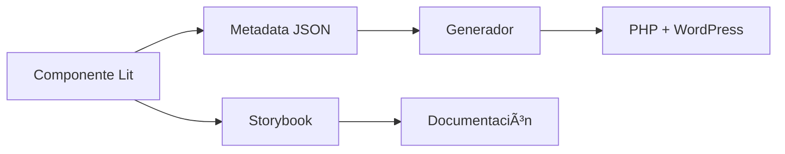

# 🎨 Toulouse Lautrec Design System

Sistema de diseño modular basado en **Lit Components** y **Design Tokens**, con generación automática de temas WordPress.

## 📋 Tabla de Contenidos

- [🏗️ Arquitectura](#️-arquitectura)
- [🚀 Inicio Rápido](#-inicio-rápido)
- [🧩 Componentes](#-componentes)
- [🎯 Design Tokens](#-design-tokens)
- [⚙️ Configuración](#️-configuración)
- [🔧 Generación WordPress](#-generación-wordpress)
- [📚 Documentación](#-documentación)
- [🛠️ Desarrollo](#️-desarrollo)
- [📦 Despliegue](#-despliegue)

## 🏗️ Arquitectura

### Estructura del Proyecto

```
toulouse-design-system/
├── src/
│   ├── components/           # Componentes Lit
│   │   ├── hero-section/
│   │   ├── course-card/
│   │   ├── testimonials/
│   │   └── feature-grid/
│   ├── tokens/
│   │   └── design-tokens.css # Variables CSS centralizadas
│   ├── component-metadata.json # Configuración completa del sistema
│   ├── page-templates.json   # Configuración de páginas
│   └── index.js             # Entry point
├── scripts/
│   ├── wp-generator/        # Generador WordPress
│   │   ├── component-generator.js  # Generación y conversión unificada
│   │   ├── template-builder.js     # Plantillas WordPress
│   │   ├── asset-manager.js        # Gestión de assets
│   │   ├── extension-manager.js    # Sistema de extensiones
│   │   ├── seo-manager.js         # SEO dinámico
│   │   ├── validation-manager.js   # Validaciones avanzadas
│   │   └── templates/             # Templates PHP
│   └── generate-wp-templates.js
├── dist/                    # Build de Vite
├── wordpress-output/        # Tema WordPress generado
└── storybook-static/        # Documentación
```

### Flujo de Trabajo



## 🚀 Inicio Rápido

### Prerrequisitos

- Node.js 24+ (recomendado)
- npm o yarn

### Instalación

```bash
# Clonar el repositorio
git clone <repository-url>
cd toulouse-design-system

# Instalar dependencias
npm install

# Iniciar desarrollo
npm run dev

# Abrir Storybook
npm run storybook
```

### Comandos Disponibles

```bash
# Desarrollo
npm run dev              # Servidor de desarrollo Vite
npm run build            # Build de producción
npm run storybook        # Documentación interactiva
npm run build-storybook  # Build de Storybook

# WordPress
npm run wp:generate      # Generar tema WordPress
npm run wp:validate      # Validar tema generado
npm run wp:validate-php  # Validar sintaxis PHP de forma interactiva

# Stories (ACTUALIZADO)
npm run stories:generate        # Generador básico (legacy)
npm run stories:generate:robust # Generador robusto (recomendado) 
npm run stories:test            # Testing del generador
```

## 🧩 Componentes

### Tipos de Componentes

El sistema soporta tres tipos de componentes con diferentes comportamientos:

#### 1. **Static** - Props Fijos
```javascript
// Lit Component
export class HeroSection extends LitElement {
  static properties = {
    title: { type: String },
    subtitle: { type: String }
  };
}
```

```json
// Metadata
{
  "hero-section": {
    "type": "static",
    "phpFunction": "render_hero_section",
    "parameters": [
      { "name": "title", "type": "string", "default": "" },
      { "name": "subtitle", "type": "string", "default": "" }
    ]
  }
}
```

#### 2. **Iterative** - Renderizado por Item
```javascript
// Lit Component
export class CourseCard extends LitElement {
  static properties = {
    title: { type: String },
    description: { type: String }
  };
}
```

```json
// Metadata
{
  "course-card": {
    "type": "iterative",
    "phpFunction": "render_course_card",
    "iteration": {
      "mode": "individual",
      "renderPerItem": true
    }
  }
}
```

#### 3. **Aggregated** - Datos Agregados
```javascript
// Lit Component
export class Testimonials extends LitElement {
  static properties = {
    testimonials: { type: Array }
  };
}
```

```json
// Metadata
{
  "testimonials": {
    "type": "aggregated",
    "phpFunction": "render_testimonials",
    "aggregation": {
      "mode": "collect",
      "dataStructure": {
        "name": "post_title",
        "content": "post_content"
      }
    }
  }
}
```

### Crear un Nuevo Componente

1. **Crear estructura de archivos:**
```bash
mkdir src/components/mi-componente
touch src/components/mi-componente/mi-componente.js
touch src/components/mi-componente/mi-componente.stories.js
```

2. **Implementar componente Lit:**
```javascript
import { LitElement, html, css } from 'lit';

export class MiComponente extends LitElement {
  static properties = {
    title: { type: String },
    items: { type: Array }
  };

  static styles = css`
    :host {
      display: block;
    }
    /* Estilos usando design tokens */
    .container {
      padding: var(--tl-spacing-8);
      background: var(--tl-neutral-50);
    }
  `;

  render() {
    return html`
      <div class="container">
        <h2>${this.title}</h2>
        ${this.items?.map(item => html`
          <div class="item">${item.name}</div>
        `)}
      </div>
    `;
  }
}

customElements.define('tl-mi-componente', MiComponente);
```

3. **Crear Storybook story:**
```javascript
import { html } from 'lit';
import '../design-system.stories.js';
import { MiComponente } from './mi-componente.js';

export default {
  title: 'Components/MiComponente',
  component: 'tl-mi-componente',
  argTypes: {
    title: { control: 'text' },
    items: { control: 'object' }
  }
};

const Template = (args) => html`
  <tl-mi-componente
    .title=${args.title}
    .items=${args.items}
  ></tl-mi-componente>
`;

export const Default = Template.bind({});
Default.args = {
  title: 'Mi Componente',
  items: [
    { name: 'Item 1' },
    { name: 'Item 2' }
  ]
};
```

4. **Agregar metadata en `component-metadata.json`:**
```json
{
  "mi-componente": {
    "type": "aggregated",
    "phpFunction": "render_mi_componente",
    "parameters": [
      { "name": "title", "type": "string", "default": "" },
      { "name": "items", "type": "array", "default": "[]" }
    ],
    "aggregation": {
      "mode": "collect",
      "dataStructure": {
        "name": "post_title",
        "description": "post_content"
      }
    }
  }
}
```

5. **Exportar en `src/index.js`:**
```javascript
import './components/mi-componente/mi-componente.js';
export { MiComponente } from './components/mi-componente/mi-componente.js';
```

## 🎯 Design Tokens

### Variables CSS Centralizadas

Los design tokens están definidos en `src/tokens/design-tokens.css`:

```css
:root {
  /* Colores */
  --tl-primary-50: #eff6ff;
  --tl-primary-500: #3b82f6;
  --tl-primary-900: #1e3a8a;
  
  /* Tipografías */
  --tl-font-primary: 'Nunito Sans', sans-serif;
  --tl-font-size-sm: 0.875rem;
  --tl-font-size-base: 1rem;
  --tl-font-size-lg: 1.125rem;
  --tl-font-size-xl: 1.25rem;
  --tl-font-size-2xl: 1.5rem;
  --tl-font-size-3xl: 1.875rem;
  
  /* Espaciados */
  --tl-spacing-1: 0.25rem;
  --tl-spacing-2: 0.5rem;
  --tl-spacing-4: 1rem;
  --tl-spacing-6: 1.5rem;
  --tl-spacing-8: 2rem;
  --tl-spacing-12: 3rem;
  --tl-spacing-16: 4rem;
  
  /* Sombras */
  --tl-shadow-sm: 0 1px 2px 0 rgb(0 0 0 / 0.05);
  --tl-shadow-md: 0 4px 6px -1px rgb(0 0 0 / 0.1);
  --tl-shadow-lg: 0 10px 15px -3px rgb(0 0 0 / 0.1);
  
  /* Transiciones */
  --tl-transition-normal: all 0.3s ease;
}
```

### Uso en Componentes

```javascript
static styles = css`
  .button {
    background: var(--tl-primary-500);
    padding: var(--tl-spacing-4) var(--tl-spacing-6);
    font-family: var(--tl-font-primary);
    font-size: var(--tl-font-size-base);
    border-radius: var(--tl-spacing-2);
    transition: var(--tl-transition-normal);
  }
`;
```

## ⚙️ Configuración

### Configuración de Páginas (`page-templates.json`)

Define la estructura de páginas WordPress con componentes:

```json
{
  "page-carreras": {
    "title": "Carreras",
    "description": "Explora nuestras carreras técnicas",
    "components": [
      {
        "name": "hero-section",
        "props": {
          "title": "Nuestras Carreras",
          "subtitle": "Descubre tu potencial creativo"
        },
        "seo": {
          "title": "Carreras | Toulouse Lautrec",
          "description": "Explora nuestras carreras técnicas",
          "keywords": "carreras, diseño, tecnología"
        },
        "analytics": {
          "pageView": "page_view_carreras",
          "events": [
            {
              "name": "hero_cta_click",
              "category": "engagement",
              "action": "click"
            }
          ]
        }
      },
      {
        "name": "course-card",
        "dataSource": {
          "type": "wordpress_posts",
          "postType": "carrera",
          "query": {
            "numberposts": -1,
            "post_status": "publish"
          }
        }
      }
    ]
  }
}
```

### Configuración del Sistema (`component-metadata.json`)

Define la configuración completa del sistema:

```json
{
  "postTypes": {
    "carrera": {
      "labels": {
        "name": "Carreras",
        "singular_name": "Carrera"
      },
      "public": true,
      "supports": ["title", "editor", "thumbnail", "excerpt"]
    },
    "testimonio": {
      "labels": {
        "name": "Testimonios", 
        "singular_name": "Testimonio"
      },
      "public": true,
      "supports": ["title", "editor", "thumbnail", "excerpt"],
      "show_in_rest": true
    }
  },
  "templates": {
    "page-carreras": {
      "file": "page-carreras.php",
      "title": "Carreras",
      "description": "Explora nuestras carreras técnicas"
    }
  },
  "componentMapping": {
    "course-card": "carrera",
    "testimonials": "testimonio"
  },
  "hero-section": {
    "type": "static",
    "phpFunction": "render_hero_section",
    "parameters": [
      {
        "name": "title",
        "type": "string", 
        "default": ""
      }
    ]
  }
}
```

## 🔧 Generación WordPress

### Proceso de Generación

1. **Limpieza**: Elimina el directorio de salida anterior
2. **Estructura**: Crea la estructura del tema WordPress
3. **Conversión**: Convierte componentes Lit a PHP
4. **Assets**: Construye y copia CSS/JS
5. **Templates**: Genera plantillas de página
6. **Validación Completa**: Verifica integridad y sintaxis PHP
7. **Reporte**: Genera reportes de validación detallados

### Estructura del Tema Generado

```
wordpress-output/toulouse-lautrec/
├── assets/
│   ├── css/
│   │   ├── design-tokens.css
│   │   └── toulouse-design-system-[hash].css
│   └── js/
│       └── toulouse-ds.[format].js
├── components/
│   ├── hero-section/
│   │   └── hero-section.php
│   ├── course-card/
│   │   └── course-card.php
│   └── testimonials/
│       └── testimonials.php
├── functions.php
├── index.php
├── front-page.php
├── page-carreras.php
└── style.css
```

### Custom Post Types

El sistema registra automáticamente CPTs basados en la metadata:

```php
// functions.php - Generado automáticamente desde component-metadata.json
function toulouse_register_post_types() {
    // Carreras
    register_post_type('carrera', array(
        'labels' => array(
            'name' => 'Carreras',
            'singular_name' => 'Carrera'
        ),
        'public' => true,
        'supports' => array('title', 'editor', 'thumbnail', 'excerpt'),
    ));
    
    // Testimonios  
    register_post_type('testimonio', array(
        'labels' => array(
            'name' => 'Testimonios',
            'singular_name' => 'Testimonio'
        ),
        'public' => true,
        'supports' => array('title', 'editor', 'thumbnail', 'excerpt'),
        'show_in_rest' => true,
    ));
}
add_action('init', 'toulouse_register_post_types');
```

### SEO y Analytics

El sistema genera automáticamente SEO y analytics por plantilla:

```php
function toulouse_page_seo_analytics() {
    if (!is_page()) return;
    
    $page_template = get_page_template_slug();
    
    $seo_config = array(
        'page-carreras' => array(
            'title' => 'Carreras | Toulouse Lautrec',
            'description' => 'Explora nuestras carreras técnicas',
            'analytics' => array(
                'pageView' => 'page_view_carreras',
                'events' => array(...)
            )
        )
    );
    
    // Aplicar configuración según plantilla
}
```

### 🔒 Validación Automática de Sintaxis PHP

El sistema incluye validación automática de sintaxis PHP para prevenir errores en WordPress:

#### 🔍 Validación Durante Generación

```bash
npm run wp:generate
```

**🆕 Características Avanzadas:**
- ✅ **Validación en tiempo real** con `php -l` al escribir cada archivo PHP
- ✅ **Pre-validación de patrones problemáticos** antes del CLI de PHP
- ✅ **Rollback automático completo** si se detectan errores
- ✅ **100% de archivos validados** antes del despliegue
- ✅ **Detección temprana** de errores de sintaxis y runtime  
- ✅ **Reportes detallados** con líneas específicas de error
- ✅ **Prevención de deployment** con errores
- ✅ **Detección de null pointers** en variables globales
- ✅ **Protección contra errores runtime** comunes
- ✅ **Limpieza CSS mejorada** (remoción de `:host` y Web Components)
- ✅ **Detección de conflictos JavaScript/PHP** en templates

#### 🛠️ Validación Interactiva

```bash
npm run wp:validate-php
```

**Salida ejemplo:**
```
🔍 Iniciando validación completa de sintaxis PHP...
🐘 PHP detectado: PHP 8.4.4 (cli)
📋 Validando archivos principales...
📄 Validando templates de página...
🧩 Validando componentes...

📊 Reporte de Validación PHP
══════════════════════════════════════════════════
📁 Archivos totales: 19
✅ Archivos válidos: 19
❌ Errores encontrados: 0
📈 Tasa de éxito: 100.0%

🎉 ¡Todos los archivos PHP tienen sintaxis correcta!
```

#### 🚨 Patrones de Error Detectados

**1. JavaScript en contexto PHP:**
```php
// ❌ Problemático - Puede confundir IDEs
?>
<script>
// gtag('config', 'GA_ID', { ... });  // "config" causa error
</script>
<?php

// ✅ Solucionado automáticamente
echo '<script>';
echo 'gtag("config", "GA_ID", { });';  // Encapsulado en echo
echo '</script>';
```

**2. Web Components CSS en WordPress:**
```css
/* ❌ CSS de Lit Components - No válido en WordPress */
:host {
  display: block;
}
.component {
  /* Sin llaves de cierre */
/* ✅ CSS limpio automáticamente */
.component-section {
  display: block;
}
```

**3. Variables globales sin validación:**
```php
// ❌ Peligroso - Null pointer
global $toulouse_seo;
echo $toulouse_seo->generateMetaTags();

// ✅ Seguro - Validado automáticamente  
global $toulouse_seo;
if ($toulouse_seo && method_exists($toulouse_seo, 'generateMetaTags')) {
    echo $toulouse_seo->generateMetaTags();
}
```

#### ❌ Manejo de Errores

Si se detectan errores:
```
❌ Errores de Sintaxis PHP:
──────────────────────────────────────────────────
📄 functions.php
   └─ Línea 181: syntax error, unexpected identifier "config"
   └─ Solución: JavaScript keywords en contexto PHP detectado

📄 seo-manager.php  
   └─ Línea 273: Uso de variable global $toulouse_seo sin verificar si existe (posible null pointer)
   └─ Solución: Usar if ($var && method_exists($var, 'method'))

📄 feature-grid.php
   └─ CSS estructura malformada: selector sin llaves de cierre
   └─ Solución: Aplicada limpieza automática de CSS

🧹 Rollback completado. No se dejaron archivos con errores.

💡 Consejos para corregir errores:
   • JavaScript keywords → Usar echo para encapsular JS
   • Variables globales → Validar con isset() y method_exists() 
   • CSS Web Components → Limpieza automática aplicada
   • Comillas no balanceadas → Verificar strings en echo statements
```

#### 📋 Prerrequisitos

- **PHP CLI** instalado en el sistema
- Versión recomendada: **PHP 8.0+**
- Compatible con PHP 7.4+ 

## 📚 Documentación

### Storybook

La documentación interactiva está disponible en:

```bash
npm run storybook
```

Accede a: `http://localhost:6006`

### Estructura de Documentación

- **Design Tokens**: Colores, tipografías, espaciados
- **Componentes**: Cada componente con sus variantes
- **🆕 Mocks Personalizados**: Datos específicos del dominio para cada componente
- **Páginas**: Ejemplos de páginas completas
- **Guías**: Patrones de uso y mejores prácticas

### Generación Automática de Stories

Los stories se generan automáticamente con datos personalizados:

```bash
npm run stories:generate:robust  # Recomendado - usa archivos .mocks.js
npm run stories:test             # Validar el generador
```

**Nuevo**: Los desarrolladores pueden crear archivos `.mocks.js` junto a sus componentes para definir datos de ejemplo específicos del dominio, eliminando la necesidad de datos genéricos.

### Generar Documentación

```bash
# Desarrollo
npm run storybook

# Build de producción
npm run build-storybook
```

## 🛠️ Desarrollo

### Workflow de Desarrollo

1. **Crear/Modificar componente** en `src/components/`
2. **Actualizar metadata** en `component-metadata.json`
3. **Documentar** en Storybook
4. **Probar** con `npm run dev`
5. **Generar WordPress** con `npm run wp:generate`
6. **Validar** con `npm run wp:validate`

### Debugging

#### Verificar Generación

```bash
# Generar con logs detallados
npm run wp:generate

# Verificar estructura generada
ls -la wordpress-output/toulouse-lautrec/

# Validar tema
npm run wp:validate
```

#### Logs de Errores

- **Componente no encontrado**: Verificar metadata en `component-metadata.json`
- **Error de PHP**: Revisar template en `php-components.js`
- **Assets faltantes**: Verificar build de Vite

### Testing

```bash
# Test de componentes
npm run test

# Test de generación
npm run wp:validate

# Test de build
npm run build
```

## 📦 Despliegue

### WordPress Local

1. **Generar tema:**
```bash
npm run wp:generate
```

2. **Copiar a WordPress:**
```bash
cp -r wordpress-output/toulouse-lautrec /path/to/wp-content/themes/
```

3. **Activar tema** en WordPress Admin

### WordPress en Producción

1. **Build de producción:**
```bash
npm run build
npm run wp:generate
```

2. **Subir archivos:**
```bash
# Subir tema completo
rsync -avz wordpress-output/toulouse-lautrec/ user@server:/var/www/html/wp-content/themes/toulouse-lautrec/
```

3. **Configurar symlinks** (opcional):
```bash
# Para desarrollo continuo
ln -s /path/to/project/wordpress-output/toulouse-lautrec /var/www/html/wp-content/themes/toulouse-lautrec
```

### CI/CD

```yaml
# .github/workflows/deploy.yml
name: Deploy WordPress Theme

on:
  push:
    branches: [main]

jobs:
  deploy:
    runs-on: ubuntu-latest
    steps:
      - uses: actions/checkout@v3
      - uses: actions/setup-node@v3
        with:
          node-version: '24'
      
      - run: npm ci
      - run: npm run build
      - run: npm run wp:generate
      
      - name: Deploy to server
        uses: appleboy/ssh-action@v0.1.5
        with:
          host: ${{ secrets.HOST }}
          username: ${{ secrets.USERNAME }}
          key: ${{ secrets.KEY }}
          script: |
            cd /var/www/html/wp-content/themes/
            rm -rf toulouse-lautrec
            cp -r /tmp/toulouse-lautrec .
```

## 🤝 Contribución

### Guías de Contribución

1. **Fork** el repositorio
2. **Crear branch** para feature: `git checkout -b feature/nuevo-componente`
3. **Desarrollar** siguiendo las convenciones
4. **Documentar** en Storybook
5. **Probar** generación WordPress
6. **Commit** con mensaje descriptivo
7. **Push** y crear Pull Request

### Convenciones

#### Naming

- **Componentes**: `kebab-case` (`hero-section`, `course-card`)
- **Funciones PHP**: `snake_case` (`render_hero_section`)
- **Variables CSS**: `kebab-case` (`--tl-primary-500`)
- **Archivos**: `kebab-case` (`hero-section.js`)

#### Estructura de Commits

```
feat: agregar componente testimonials
fix: corregir generación de PHP para course-card
docs: actualizar documentación de design tokens
refactor: simplificar metadata de componentes
```

#### Code Style

- **JavaScript**: ESLint + Prettier
- **CSS**: Design tokens centralizados
- **PHP**: WordPress Coding Standards
- **JSON**: Formato consistente

## 📄 Licencia

Este proyecto está bajo la licencia MIT. Ver `LICENSE` para más detalles.

## 🆘 Soporte

### Problemas Comunes

#### Error: "No se encontró metadata para el componente"

**Solución**: Agregar metadata en `component-metadata.json`

#### Error: "Componente no se genera correctamente"

**Solución**: Verificar estructura del componente Lit y metadata

#### Error: "Assets no se copian"

**Solución**: Verificar build de Vite y permisos de directorio

### Recursos

**📚 Documentación del Proyecto:**
- **[🆕 Guía de Mocks Personalizados](./CUSTOM_MOCKS_GUIDE.md)** - Cómo crear datos de ejemplo personalizados
- [📚 Generador de Stories](./STORIES_GENERATOR_GUIDE.md) - Sistema automático de generación de stories  
- [🎯 Tutorial End-to-End](./TUTORIAL_END_TO_END.md) - De Lit Component a WordPress
- [🧩 Guía de Extensiones](./EXTENSIONS_GUIDE.md) - Extensiones para WordPress
- [🚀 Guía de Despliegue](./WORDPRESS-DEPLOYMENT.md) - Despliegue en WordPress

**🌐 Documentación Externa:**
- [Documentación Lit](https://lit.dev/docs/)
- [WordPress Theme Handbook](https://developer.wordpress.org/themes/)
- [Storybook Documentation](https://storybook.js.org/docs/)
- [Design Tokens Guide](https://www.designtokens.org/)

### Contacto

- **Issues**: [GitHub Issues](https://github.com/org/toulouse-design-system/issues)
- **Discussions**: [GitHub Discussions](https://github.com/org/toulouse-design-system/discussions)
- **Email**: design-system@toulouselautrec.edu.pe

---

**Desarrollado con ❤️ por el equipo de Toulouse Lautrec**
