# 🎯 Tutorial End-to-End: De Lit Component a WordPress

Este tutorial te guía paso a paso desde la creación de un componente Lit en Storybook hasta su generación completa como tema WordPress, incluyendo extensiones avanzadas.

## 📋 Tabla de Contenidos

- [🎯 Objetivo](#-objetivo)
- [🏁 Prerrequisitos](#-prerrequisitos)
- [📖 Paso a Paso](#-paso-a-paso)
  - [Paso 1: Crear el Componente Lit](#paso-1-crear-el-componente-lit)
  - [Paso 2: Documentar en Storybook](#paso-2-documentar-en-storybook)
  - [Paso 3: Configurar Metadata (Nueva Arquitectura)](#paso-3-configurar-metadata-nueva-arquitectura)
  - [Paso 4: Configurar WordPress Data (page-templates.json)](#paso-4-configurar-wordpress-data-page-templatesjson)
  - [Paso 5: Crear Extensión Personalizada](#paso-5-crear-extensión-personalizada)
  - [Paso 6: Generar Tema WordPress](#paso-6-generar-tema-wordpress)
  - [Paso 7: Validar y Probar](#paso-7-validar-y-probar)
- [🔧 Personalización Avanzada](#-personalización-avanzada)
- [🚀 Despliegue en Producción](#-despliegue-en-producción)
- [🛠️ Troubleshooting](#️-troubleshooting)
- [🚨 Comportamiento Fail-Fast](#-comportamiento-fail-fast)

## 🎯 Objetivo

Al final de este tutorial habrás:

✅ Creado un componente Lit funcional  
✅ Documentado el componente en Storybook  
✅ Configurado metadata para WordPress  
✅ Creado una extensión personalizada  
✅ Generado un tema WordPress completo  
✅ Validado el funcionamiento end-to-end  

## 🏁 Prerrequisitos

- Node.js 18+ instalado
- Conocimientos básicos de JavaScript/PHP
- WordPress local (opcional, para testing)

```bash
# Verificar instalación
node --version
npm --version
```

## 📖 Paso a Paso

### Paso 1: Crear el Componente Lit

Vamos a crear un componente **Product Card** que mostrará productos/servicios.

#### 1.1 Crear estructura de archivos (Arquitectura Modernizada)

```bash
mkdir src/components/product-card
touch src/components/product-card/product-card.js
touch src/components/product-card/product-card.css    # ← CSS separado (NUEVO)
touch src/components/product-card/product-card.stories.js
```

**🎯 Separación obligatoria de estilos:**
- **JS**: Solo lógica del componente
- **CSS**: Todos los estilos en archivo separado
- **Benefits**: Mejor conversión Lit→PHP, optimización Vite, mantenibilidad

#### 1.2 Crear CSS separado (CRÍTICO - Arquitectura Modernizada)

**🚨 REGLA CRÍTICA: NUNCA usar inline styles en Lit Components**

```css
/* src/components/product-card/product-card.css - OBLIGATORIO archivo separado */
.product-card {
  background: var(--tl-neutral-50);
  border-radius: var(--tl-spacing-2);
  border: 1px solid var(--tl-neutral-200);
  padding: var(--tl-spacing-4);
  transition: var(--tl-transition-normal);
  box-shadow: var(--tl-shadow-sm);
  height: 100%;
  display: flex;
  flex-direction: column;
}

.product-card:hover {
  transform: translateY(-2px);
  box-shadow: var(--tl-shadow-lg);
}

.product-card.featured {
  border: 2px solid var(--tl-primary-300);
  background: var(--tl-primary-50);
}

.product-image {
  width: 100%;
  height: 200px;
  object-fit: cover;
  border-radius: var(--tl-spacing-2);
  margin-bottom: var(--tl-spacing-3);
}

.product-category {
  display: inline-block;
  background: var(--tl-primary-100);
  color: var(--tl-primary-700);
  padding: var(--tl-spacing-1) var(--tl-spacing-2);
  border-radius: var(--tl-spacing-1);
  font-size: var(--tl-font-size-sm);
  font-weight: 600;
  margin-bottom: var(--tl-spacing-2);
}

.product-title {
  font-size: var(--tl-font-size-xl);
  font-weight: 700;
  color: var(--tl-neutral-900);
  margin-bottom: var(--tl-spacing-2);
  line-height: 1.3;
}

.product-description {
  color: var(--tl-neutral-600);
  line-height: 1.5;
  margin-bottom: var(--tl-spacing-4);
  flex-grow: 1;
}

.product-price {
  font-size: var(--tl-font-size-2xl);
  font-weight: 700;
  color: var(--tl-primary-600);
  margin-bottom: var(--tl-spacing-4);
}

.product-link {
  display: inline-flex;
  align-items: center;
  background: var(--tl-primary-500);
  color: white;
  padding: var(--tl-spacing-3) var(--tl-spacing-4);
  border-radius: var(--tl-spacing-2);
  text-decoration: none;
  font-weight: 600;
  transition: var(--tl-transition-normal);
}

.product-link:hover {
  background: var(--tl-primary-600);
  transform: translateY(-1px);
}

.product-link::after {
  content: '→';
  margin-left: var(--tl-spacing-2);
  transition: var(--tl-transition-normal);
}

.product-link:hover::after {
  transform: translateX(4px);
}
```

#### 1.3 Implementar el componente Lit (Solo lógica)

```javascript
// src/components/product-card/product-card.js
import { LitElement, html } from 'lit';

export class ProductCard extends LitElement {
  static properties = {
    title: { type: String },
    description: { type: String },
    price: { type: String },
    image: { type: String },
    category: { type: String },
    featured: { type: Boolean },
    link: { type: String },
    linkText: { type: String }
  };

  constructor() {
    super();
    this.title = '';
    this.description = '';
    this.price = '';
    this.image = '';
    this.category = '';
    this.featured = false;
    this.link = '';
    this.linkText = 'Ver más';
  }

  // ⚡ SIN static styles - CSS en archivo separado

  render() {
    return html`
      <div class="product-card ${this.featured ? 'featured' : ''}">
        ${this.image ? html`
          
        ` : ''}

        ${this.category ? html`
          <div class="product-category">${this.category}</div>
        ` : ''}

        <h3 class="product-title">${this.title}</h3>

        ${this.description ? html`
          <p class="product-description">${this.description}</p>
        ` : ''}

        ${this.price ? html`
          <div class="product-price">${this.price}</div>
        ` : ''}

        ${this.link ? html`
          <a href="${this.link}" class="product-link">
            ${this.linkText}
          </a>
        ` : ''}
      </div>
    `;
  }
}

customElements.define('tl-product-card', ProductCard);
```

#### 1.4 Importar CSS en main.css (Sistema Automático)

```css
/* src/main.css - El generador agregará automáticamente: */
@import './components/product-card/product-card.css';

/* Los estilos se optimizan automáticamente por Vite:
   - Minificación
   - Tree-shaking
   - Cache-busting
   - Prefijos vendor automáticos
*/
```

#### **🎯 Ventajas de la Separación CSS (Arquitectura Modernizada)**

**✅ Conversión Lit → PHP mejorada:**
- Babel AST procesa solo lógica, sin estilos inline complejos
- PHP generado más limpio y legible
- Sin conversión problemática de CSS-in-JS

**✅ Optimización WordPress:**
- CSS se enqueue como archivos separados
- Mejor caching del navegador
- Menos JavaScript payload

**✅ Mantenibilidad:**
- Fácil editar estilos sin tocar lógica
- Mejor experiencia en IDEs (syntax highlighting)
- Separation of concerns real

**✅ Performance:**
- Vite optimiza CSS por separado
- Critical CSS extraction
- Mejor Core Web Vitals

**⚠️ Migración desde inline styles:**
```bash
# Si tienes componentes con static styles, migrarlos:
# 1. Mover todo el CSS de static styles = css`` a .css
# 2. Eliminar import css from 'lit'
# 3. Regenerar con npm run wp:generate
```
  // ✅ SIN static styles - CSS en archivo separado
```

### Paso 2: Documentar en Storybook (Actualizado con Mocks Personalizados)

#### 2.1 Crear datos personalizados del componente

Primero, vamos a crear datos de ejemplo específicos para nuestro Product Card:

```javascript
// src/components/product-card/product-card.mocks.js
/**
 * Datos de ejemplo para Product Card
 * Específicos del dominio de productos/servicios
 */
module.exports = {
  // Datos por defecto para el story principal
  defaultArgs: {
    title: 'Diseño Gráfico Digital',
    description: 'Curso completo de diseño gráfico con herramientas profesionales como Photoshop, Illustrator y InDesign. Aprende desde los fundamentos hasta proyectos avanzados.',
    price: 'S/ 1,250',
    image: 'https://images.unsplash.com/photo-1561070791-2526d30994b5?w=400&h=300&fit=crop',
    category: 'Diseño',
    featured: false,
    link: '#curso-diseño-grafico',
    linkText: 'Ver curso completo'
  },

  // Variantes para diferentes estados
  variants: {
    featured: {
      title: 'Desarrollo Web Full Stack',
      description: 'Conviértete en desarrollador full stack con tecnologías modernas: HTML5, CSS3, JavaScript, React, Node.js y bases de datos.',
      price: 'S/ 1,800',
      image: 'https://images.unsplash.com/photo-1461749280684-dccba630e2f6?w=400&h=300&fit=crop',
      category: 'Programación',
      featured: true,
      link: '#curso-desarrollo-web',
      linkText: 'Inscríbete ahora'
    },

    premium: {
      title: 'Marketing Digital Avanzado',
      description: 'Domina el marketing digital con estrategias de SEO, SEM, redes sociales, email marketing y analytics. Incluye certificación Google.',
      price: 'S/ 2,100',
      image: 'https://images.unsplash.com/photo-1460925895917-afdab827c52f?w=400&h=300&fit=crop',
      category: 'Marketing',
      featured: true,
      link: '#curso-marketing-digital',
      linkText: 'Más información',
      isPremium: true
    },

    loading: {
      title: 'Cargando...',
      description: 'Obteniendo información del producto...',
      price: '---',
      image: '',
      category: '',
      featured: false,
      link: '#',
      linkText: 'Cargando',
      isLoading: true
    },

    error: {
      title: 'Error al cargar',
      description: 'No se pudo cargar la información del producto. Intenta nuevamente.',
      price: 'N/A',
      image: '',
      category: 'Error',
      featured: false,
      link: '#',
      linkText: 'Reintentar',
      hasError: true
    }
  }
};
```

#### 2.2 Configurar metadata PRIMERO (Nueva Arquitectura)

**🎯 CRITICAL: Con la nueva arquitectura Single Source of Truth, PRIMERO debemos configurar metadata.json antes de generar stories:**

```json
// src/metadata.json (agregar product-card)
{
  // ... otros componentes
  "product-card": {
    "type": "iterative",
    "phpFunction": "render_product_card",
    "parameters": [
      { "name": "title", "type": "string", "default": "", "escape": "html" },
      { "name": "description", "type": "string", "default": "", "escape": "html" },
      { "name": "price", "type": "string", "default": "", "escape": "html" },
      { "name": "image", "type": "string", "default": "", "escape": "url" },
      { "name": "category", "type": "string", "default": "", "escape": "html" },
      { "name": "featured", "type": "boolean", "default": "false", "escape": "none" },
      { "name": "link", "type": "string", "default": "", "escape": "url" },
      { "name": "linkText", "type": "string", "default": "", "escape": "html" }
    ]
  }
}
```

#### 2.3 Generar stories automáticamente desde metadata

**🚀 Ahora el generador usa SOLO metadata.json como fuente única:**

```bash
# Opción 1: Generar para todos los componentes
npm run stories:generate:robust

# Opción 2: CLI avanzado - Solo el componente específico (recomendado)
node src/storybook/generate-stories-robust.js product-card  # Solo product-card
node src/storybook/generate-stories-robust.js --help       # Ver todas las opciones
```

**🎯 Ventajas del CLI por componente:**
- ✅ **Backup automático**: Crea `.backup` antes de sobrescribir
- ✅ **Velocidad**: Solo regenera el componente que cambió
- ✅ **Desarrollo iterativo**: Perfecto para ajustar un componente específico

**🎯 El generador usa ConfigSingleton + metadata.json como fuente única:**

```bash
🔍 Generador Robusto: Buscando componentes sin stories...
📝 Encontrados 1 componentes sin stories:
   - product-card

🎯 Generando stories para: product-card
🎯 ConfigSingleton.getMetadata() → Leyendo metadata.json
✅ Componente 'product-card' encontrado en metadata.json
📦 Usando mocks personalizados para product-card
✅ Stories generados: product-card
   Usando parameters exactos desde metadata.json
```

#### 2.4 Story generado con Single Source of Truth

**✨ Ventajas del nuevo generador:**
- ✅ **Zero duplication**: Properties exactos desde metadata.json
- ✅ **Fail-fast**: Error inmediato si componente no está en metadata
- ✅ **Consistent data**: Same source para WordPress y Storybook
- ✅ **Auto-controls**: Types mapeados automáticamente (string→text, boolean→boolean)

**⚠️ Fail-Fast en acción - Si olvidas configurar metadata:**
```bash
🎯 Generando stories para: product-card
❌ FAIL FAST: Componente 'product-card' no encontrado en metadata.json
💡 Solución: Agregar 'product-card' a src/metadata.json con sus parameters
```

**🔧 Esto garantiza que nunca tengas inconsistencias entre Storybook y WordPress.**

```javascript
// src/components/product-card/product-card.stories.js (GENERADO AUTOMÁTICAMENTE)
import '../../design-system.stories.js';
import './product-card.js';

export default {
  title: 'Components/Product Card',
  component: 'product-card',
  argTypes: {
    // 🎯 Generado desde metadata.json parameters
    "title": {
        "control": "text",
        "description": "Tipo: string. Default: \"\""
    },
    "description": {
        "control": "text",
        "description": "Tipo: string. Default: \"\""
    },
    "price": {
        "control": "text",
        "description": "Tipo: string. Default: \"\""
    },
    "image": {
        "control": "text",
        "description": "Tipo: string. Default: \"\""
    },
    "featured": {
        "control": "boolean",
        "description": "Tipo: boolean. Default: \"false\""
    }
    // ... otros controles generados automáticamente
  },
  parameters: {
    docs: {
      description: {
        component: `
# Product Card

Componente para mostrar productos o servicios con datos personalizados específicos del dominio educativo.

## Características

- ✅ Responsive design
- ✅ Accesible (ARIA)
- ✅ Theming con design tokens
- ✅ Integración WordPress automática

## Uso en WordPress

Recopila y muestra datos agregados de múltiples posts de WordPress.
        `
      }
    }
  }
};

const Template = (args) => {
  const element = document.createElement('tl-product-card');
  element.title = args.title;
  element.description = args.description;
  element.price = args.price;
  element.image = args.image;
  element.category = args.category;
  element.featured = args.featured;
  element.link = args.link;
  element.linkText = args.linkText;
  return element;
};

// Stories generados automáticamente usando nuestros mocks personalizados
export const Default = Template.bind({});
Default.args = {
  title: 'Diseño Gráfico Digital',
  description: 'Curso completo de diseño gráfico con herramientas profesionales...',
  price: 'S/ 1,250',
  image: 'https://images.unsplash.com/photo-1561070791-2526d30994b5...',
  category: 'Diseño',
  featured: false,
  link: '#curso-diseño-grafico',
  linkText: 'Ver curso completo'
};

export const Featured = Template.bind({});
Featured.args = {
  title: 'Desarrollo Web Full Stack',
  description: 'Conviértete en desarrollador full stack...',
  price: 'S/ 1,800',
  // ... datos específicos del mock
  featured: true
};

export const Premium = Template.bind({});
Premium.args = {
  title: 'Marketing Digital Avanzado',
  description: 'Domina el marketing digital...',
  price: 'S/ 2,100',
  // ... datos específicos del mock
  isPremium: true
};

export const Loading = Template.bind({});
Loading.args = {
  title: 'Cargando...',
  description: 'Obteniendo información del producto...',
  isLoading: true
};

export const Error = Template.bind({});
Error.args = {
  title: 'Error al cargar',
  description: 'No se pudo cargar la información...',
  hasError: true
};
```

#### 2.4 Resultado del Sistema

✅ **5 stories generados automáticamente** usando nuestros datos personalizados:
- `Default`: Curso de Diseño Gráfico
- `Featured`: Curso de Desarrollo Web (destacado)
- `Premium`: Marketing Digital (premium)
- `Loading`: Estado de carga
- `Error`: Estado de error

✅ **Datos realistas**: Específicos del dominio educativo
✅ **Múltiples estados**: Cubre casos de uso reales
✅ **Documentación automática**: Generada con contexto

#### 2.5 Verificar en Storybook

```bash
npm run storybook
```

Navega a `http://localhost:6006` y verifica que:

✅ **5 stories aparezcan automáticamente** con nombres significativos
✅ **Datos realistas del dominio educativo** se muestren en cada story  
✅ **Estados diferentes** (normal, destacado, premium, loading, error) funcionen
✅ **Controles interactivos** permitan modificar las propiedades en tiempo real

**💡 Ventaja del nuevo sistema**: Sin archivos `.mocks.js`, habrías tenido datos genéricos como "Título del Componente" y arrays vacíos. Con mocks personalizados, tienes datos específicos del dominio que demuestran mejor el propósito real del componente.

### Paso 3: Configurar Metadata (Nueva Arquitectura)

Con la nueva arquitectura refactorizada, hemos separado las responsabilidades para mayor cohesión y mantenibilidad.

#### 🎯 **NUEVA ARQUITECTURA REFACTORIZADA: Separación Clara de Responsabilidades**

**🔑 PRINCIPIO CLAVE**: Single Source of Truth por dominio

##### **📋 `src/metadata.json` - SOLO Metadata de Componentes**
- **QUÉ**: Escape, estructura, parameters, arrayFields
- **PROPÓSITO**: Definir cómo funciona el componente internamente
- **RESPONSIBILITY**: Metadata técnico y validaciones

```json
{
  "product-card": {
    "type": "aggregated",
    "parameters": [
      { "name": "title", "type": "string", "escape": "html" },
      { "name": "description", "type": "string", "escape": "html" },
      { "name": "price", "type": "string", "escape": "html" },
      { "name": "image", "type": "string", "escape": "url" },
      { "name": "category", "type": "string", "escape": "html" },
      { "name": "featured", "type": "boolean", "escape": "html" },
      { "name": "link", "type": "string", "escape": "url" },
      { "name": "linkText", "type": "string", "escape": "html" }
    ],
    "arrayFields": {
      "products": [
        { "name": "title", "type": "string", "fieldType": "text", "escape": "html" },
        { "name": "price", "type": "string", "fieldType": "text", "escape": "html" },
        { "name": "image", "type": "string", "fieldType": "image", "escape": "url" },
        { "name": "featured", "type": "boolean", "fieldType": "boolean", "escape": "html" }
      ]
    }
  }
}
```

##### **🏗️ `src/page-templates.json` - TODO WordPress**
- **QUÉ**: postTypes, queries, mappings, SEO, props
- **PROPÓSITO**: Definir cómo se conecta con WordPress
- **RESPONSIBILITY**: Configuración WordPress completa

```json
{
  "postTypes": {
    "producto": {
      "labels": {
        "name": "Productos",
        "singular_name": "Producto"
      },
      "public": true,
      "supports": ["title", "editor", "thumbnail", "excerpt", "custom-fields"],
      "show_in_rest": true
    }
  },
  "page-productos": {
    "file": "page-productos.php",
    "title": "Nuestros Productos",
    "description": "Explora nuestra gama completa de productos y servicios",
    "seo": {
      "title": "Productos | Mi Empresa",
      "description": "Descubre nuestros productos y servicios de alta calidad"
    },
    "components": [{
      "name": "product-card",
      "dataSource": {
        "type": "post",
        "postType": "producto",
        "query": {
          "numberposts": -1,
          "post_status": "publish"
        },
        "mapping": {
          "title": { "source": "post_title", "type": "native" },
          "description": { "source": "post_excerpt", "type": "native" },
          "price": { "source": "meta_precio", "type": "acf" },
          "image": { "source": "post_thumbnail_url", "type": "native" },
          "category": { "source": "meta_categoria", "type": "acf" },
          "featured": { "source": "meta_destacado", "type": "acf" },
          "link": { "source": "post_permalink", "type": "native" },
          "linkText": { "source": "Ver producto", "type": "static" }
        }
      }
    }]
  }
}
```

##### **🔄 Nuevo Flujo del Sistema Refactorizado**

```mermaid
graph TD
    A[page-templates.json] -->|postTypes + dataSource| B[ConfigSingleton]
    C[metadata.json] -->|escape + parameters| B
    B --> D[Component Generator]
    D --> E[PHP con post_type correcto]
    D --> F[Escape automático aplicado]
    D --> G[ACF fields auto-generados]

    E --> H[get_posts con post_type específico]
    H --> I[Datos reales de WordPress]
    I --> J[Componente renderizado con seguridad]
```



##### **🏗️ Ventajas de la Nueva Arquitectura**

✅ **Cohesión contextual**: postTypes donde se usan (con queries y mappings)
✅ **Single source por dominio**: metadata.json = escape, page-templates.json = WordPress
✅ **Mantenibilidad superior**: Un cambio en postType se ve inmediatamente donde se usa
✅ **Escalabilidad**: Fácil agregar páginas con sus propios postTypes
✅ **No redundancia**: Eliminada duplicación entre archivos
✅ **ConfigSingleton**: Source of truth centralizada sin cache

##### **📋 Ejemplo Completo: Product Card**

**page-templates.json** (QUÉ datos):
```json
{
  "page-productos": {
    "components": [{
      "name": "product-card",
      "dataSource": "post"  // Obtener posts WordPress
    }]
  }
}
```

**page-templates.json** (DÓNDE viene el dato):
```json
{
  "page-productos": {
    "components": [{
      "name": "product-card",
      "dataSource": {
        "type": "post",
        "postType": "producto",
        "mapping": {
          "title": {"source": "post_title", "type": "native"},
          "description": {"source": "post_excerpt", "type": "native"},
          "price": {"source": "meta_precio", "type": "acf"},
          "featured": {"source": "meta_destacado", "type": "acf"}
        }
      }
    }]
  }
}
```

**🎯 PHP Generado Automáticamente:**
```php
// El sistema combina metadata.json + page-templates.json:
$productos = get_posts(['post_type' => 'producto']); // ← dataSource.postType
$productos_data = array();
foreach ($productos as $item) {
    $productos_data[] = array(
        'title' => get_the_title($item),                           // ← mapping.title
        'description' => get_the_excerpt($item),                   // ← mapping.description
        'price' => get_field('precio', $item->ID) ?: '',          // ← mapping.price (ACF)
        'featured' => (function() use ($item) {                   // ← mapping.featured (ACF + fieldType: "image")
            $field = get_field('destacado', $item->ID);
            if (is_array($field) && isset($field['url'])) return $field['url'];
            if (is_numeric($field) && !empty($field)) return wp_get_attachment_image_url((int) $field, 'full') ?: '';
            return '';
        })()
    );
}
render_product_card($productos_data);
```

##### **⚡ Tipos de DataSource Válidos**

| DataSource | WordPress Query | Uso Típico |
|------------|-----------------|------------|
| `"post"` | `get_posts(['post_type' => 'post'])` | Blog posts, noticias |
| `"page"` | `get_posts(['post_type' => 'page'])` | Páginas estáticas |
| `"custom"` | `get_posts(['post_type' => 'producto'])` | Custom Post Types |
| `"api"` | `wp_remote_get()` | APIs externas |

##### **🔧 Tipos de Field Sources**

| Type | Source Example | WordPress Function |
|------|----------------|-------------------|
| `"native"` | `"post_title"` | `get_the_title()` |
| `"native"` | `"post_excerpt"` | `get_the_excerpt()` |
| `"native"` | `"post_thumbnail_url"` | `get_the_post_thumbnail_url()` |
| `"acf"` | `"meta_precio"` | `get_post_meta($id, 'precio', true)` |
| `"acf"` | `"meta_destacado"` | `get_post_meta($id, 'destacado', true)` |

##### **✅ BENEFICIOS de la Arquitectura Dual**

1. **🎯 Separación de responsabilidades**:
   - `dataSource`: Configuración de página específica
   - `wordpressData`: Configuración de componente reutilizable

2. **🔄 Reutilización máxima**:
   - Un componente (metadata) funciona en múltiples páginas (page-templates)
   - El mapeo de campos se define una sola vez

3. **🛠️ Flexibilidad total**:
   - Cambiar fuente de datos sin modificar el componente
   - Mapear campos diferentes para el mismo componente

4. **🚨 Fail-fast real**:
   - Validación estricta de ambas configuraciones
   - Error claro si falta alguna de las dos

##### **⚡ LÓGICA DE PRIORIDAD: props vs dataSource**

**🔑 PREGUNTA CRÍTICA**: Si un componente tiene `props` Y `dataSource`, ¿cuál tiene prioridad?

**📋 RESPUESTA**: Depende del **tipo de componente**:

| Tipo | Prioridad | Comportamiento |
|------|-----------|----------------|
| **`static`** | ❌ **SOLO props** | Ignora dataSource (error si existe) |
| **`iterative`** | 🥇 **dataSource** | WordPress data siempre gana, props solo para fallback |
| **`aggregated`** | 🔄 **Híbrido** | dataSource para arrays, props para configuración |

##### **📚 EJEMPLOS DETALLADOS POR TIPO:**

###### **1. Tipo `static` - Solo props**
```json
// page-templates.json
{
  "name": "hero-section",
  "props": {
    "title": "Bienvenido"  // ← ÚNICA fuente
  }
  // dataSource NO permitido
}
```

**PHP generado:**
```php
render_hero_section('Bienvenido');  // Valores fijos
```

###### **2. Tipo `iterative` - dataSource domina**
```json
// page-templates.json
{
  "name": "course-card",
  "props": {
    "linkText": "Ver más"  // ← Solo para valores NO mapeados
  },
  "dataSource": {
    "type": "post",
    "mapping": {
      "title": "post_title"  // ← PRIORIDAD TOTAL
    }
  }
}
```

**PHP generado:**
```php
foreach ($posts as $post) {
    render_course_card(
        $post->post_title,    // ← dataSource (prioridad)
        'Ver más'             // ← props (solo no-mapeados)
    );
}
```

###### **3. Tipo `aggregated` - Híbrido**
```json
// page-templates.json
{
  "name": "testimonials",
  "props": {
    "title": "Testimonios",      // ← Props para configuración
    "subtitle": "Nuestros éxitos"
  },
  "dataSource": {
    "type": "post",
    "aggregation": {
      "mode": "collect",       // ← dataSource para el array
      "dataStructure": {
        "name": "post_title"
      }
    }
  }
}
```

**PHP generado:**
```php
$testimonials = [/* array desde dataSource */];
render_testimonials(
    'Testimonios',        // ← props (configuración)
    'Nuestros éxitos',    // ← props (configuración)
    $testimonials         // ← dataSource (contenido)
);
```

##### **🎯 REGLAS MEMORABLES:**

1. **`static`**: "Props únicos, no WordPress"
2. **`iterative`**: "WordPress first, props backup"
3. **`aggregated`**: "WordPress para contenido, props para estructura"

##### **❌ ERROR COMÚN: Confundir los Niveles**

```json
// ❌ INCORRECTO: Poner wordpressData en page-templates.json
{
  "page-productos": {
    "components": [{
      "name": "product-card",
      "wordpressData": { "fields": {...} }  // ← UBICACIÓN INCORRECTA
    }]
  }
}

// ❌ INCORRECTO: Poner dataSource en metadata.json
{
  "product-card": {
    "dataSource": "post"  // ← UBICACIÓN INCORRECTA
  }
}
```

```json
// ✅ CORRECTO: Cada configuración en su lugar
// page-templates.json
{
  "page-productos": {
    "components": [{
      "name": "product-card",
      "dataSource": "post"  // ← QUÉ datos usar
    }]
  }
}

// metadata.json
{
  "product-card": {
    "wordpressData": {
      "fields": {...}  // ← CÓMO mapear campos
    }
  }
}
```

#### 3.1 Estructura General del Metadata

El archivo `src/metadata.json` contiene las configuraciones principales de componentes:

```json
{
  "postTypes": { /* Tipos de posts personalizados WordPress */ },
  "templates": { /* Plantillas de página PHP */ },
  "componentMapping": { /* Mapeo componente → post_type */ },
  "[component-name]": { /* Configuración por componente */ }
}
```

---

#### 3.2 Sección PostTypes - Tipos de Contenido WordPress

Define los **Custom Post Types** que alimentarán tus componentes con datos reales:

| Atributo | Tipo | Obligatorio | Descripción | Ejemplo |
|----------|------|-------------|-------------|---------|
| `labels.name` | string | ✅ | Nombre plural en WordPress admin | "Carreras", "Productos" |
| `labels.singular_name` | string | ✅ | Nombre singular en WordPress admin | "Carrera", "Producto" |
| `public` | boolean | ❌ | Si aparece en front-end y admin | `true` |
| `supports` | array | ❌ | Funcionalidades WordPress | `["title", "editor", "thumbnail"]` |
| `show_in_rest` | boolean | ❌ | API REST habilitada | `true` |

**Ejemplo práctico:**
```json
"postTypes": {
  "carrera": {
    "labels": { "name": "Carreras", "singular_name": "Carrera" },
    "public": true,
    "supports": ["title", "editor", "thumbnail", "excerpt"],
    "show_in_rest": true
  }
}
```

**🔄 Lógica de uso:** El sistema usa `componentMapping` para conectar componentes con postTypes. Si tu componente `course-card` está mapeado a `carrera`, automáticamente consumirá datos del post_type `carrera`.

---

#### 3.3 Sección Templates - Páginas WordPress

Define las **plantillas PHP** que se generarán automáticamente:

| Atributo | Tipo | Obligatorio | Descripción |
|----------|------|-------------|-------------|
| `file` | string | ✅ | Nombre del archivo PHP generado |
| `title` | string | ✅ | Título para WordPress admin |
| `description` | string | ❌ | Descripción de la plantilla |

**Ejemplo:**
```json
"templates": {
  "page-carreras": {
    "file": "page-carreras.php",
    "title": "Carreras",
    "description": "Listado de todas las carreras disponibles"
  }
}
```

---

#### 3.4 Sección ComponentMapping - Conexión Componente ↔ Datos

Conecta componentes con sus fuentes de datos:

```json
"componentMapping": {
  "course-card": "carrera",     // course-card consume posts del tipo "carrera"
  "product-card": "producto",   // product-card consume posts del tipo "producto"
  "testimonials": "testimonio"  // testimonials consume posts del tipo "testimonio"
}
```

**🔄 Lógica:** Si no hay mapping, el componente se considera estático y usará valores por defecto.

---

#### 3.5 Arquitectura Actualizada - Tipos de Componentes y Configuración

### **🧩 TIPOS DE COMPONENTES (Arquitectura Actual)**

#### **1. STATIC COMPONENTS** - Datos fijos hardcodeados

Para componentes como heroes, headers, footers que no cambian dinámicamente.

**metadata.json:**
```json
{
  "hero-section": {
    "type": "static",
    "parameters": [
      { "name": "title", "type": "string" },
      { "name": "subtitle", "type": "string" },
      { "name": "ctaText", "type": "string" }
    ]
  }
}
```

**page-templates.json:**
```json
{
  "page-inicio": {
    "components": [{
      "name": "hero-section",
      "props": {
        "title": "Bienvenidos a Toulouse",
        "subtitle": "Descubre tu potencial creativo",
        "ctaText": "Comenzar"
      }
    }]
  }
}
```

**PHP generado:**
```php
render_hero_section('Bienvenidos a Toulouse', 'Descubre tu potencial creativo', 'Comenzar');
```

---

#### **2. ITERATIVE COMPONENTS** - Un componente por cada post

Para cards, items que se repiten individualmente (bucles simples).

**metadata.json:**
```json
{
  "course-card": {
    "type": "iterative",
    "parameters": [
      { "name": "title", "type": "string" },
      { "name": "description", "type": "string" },
      { "name": "image", "type": "string" },
      { "name": "link", "type": "string" }
    ]
  }
}
```

**page-templates.json:**
```json
{
  "page-carreras": {
    "components": [{
      "name": "course-card",
      "props": {
        "title": "",
        "description": "",
        "image": "",
        "link": ""
      },
      "dataSource": {
        "type": "post",
        "postType": "carrera",
        "query": { "numberposts": -1 },
        "mapping": {
          "title": { "source": "post_title", "type": "native" },
          "description": { "source": "post_excerpt", "type": "native" },
          "image": { "source": "post_thumbnail_url", "type": "native" },
          "link": { "source": "post_permalink", "type": "native" }
        }
      }
    }]
  }
}
```

**PHP generado:**
```php
$items = get_posts(['numberposts' => -1, 'post_status' => 'publish', 'post_type' => 'carrera']);
if (!empty($items)) {
    foreach ($items as $item) {
        render_course_card(
            get_the_title($item),
            get_the_excerpt($item),
            get_the_post_thumbnail_url($item, 'medium'),
            get_permalink($item)
        );
    }
}
```

---

#### **3. AGGREGATED COMPONENTS** - Un componente con array de datos complejos

Para componentes que coleccionan múltiples posts en un solo array (con ACF fields).

**metadata.json:**
```json
{
  "testimonials": {
    "type": "aggregated",
    "parameters": [
      { "name": "title", "type": "string" },
      { "name": "subtitle", "type": "string" },
      { "name": "testimonials", "type": "array" }
    ],
    "arrayFields": [
      { "name": "name", "type": "string", "fieldType": "text" },
      { "name": "role", "type": "string", "fieldType": "text" },
      { "name": "content", "type": "string", "fieldType": "textarea" },
      { "name": "rating", "type": "number", "fieldType": "number" },
      { "name": "user_photo", "type": "string", "fieldType": "image" },
      { "name": "course", "type": "string", "fieldType": "text" }
    ]
  }
}
```

**page-templates.json:**
```json
{
  "page-carreras": {
    "components": [{
      "name": "testimonials",
      "props": {
        "title": "Lo que dicen nuestros estudiantes",
        "subtitle": "Testimonios de éxito de nuestros egresados"
      },
      "dataSource": {
        "type": "post",
        "postType": "testimonio",
        "query": { "numberposts": 6 },
        "mapping": {
          "name": { "source": "post_title", "type": "native" },
          "role": { "source": "meta_role", "type": "acf" },
          "content": { "source": "post_content", "type": "native" },
          "rating": { "source": "meta_rating", "type": "acf" },
          "user_photo": { "source": "meta_user_photo", "type": "acf" },
          "course": { "source": "meta_course", "type": "acf" }
        }
      }
    }]
  }
}
```

**PHP generado:**
```php
$items = get_posts(['numberposts' => 6, 'post_status' => 'publish', 'post_type' => 'testimonio']);
$testimonials_data = array();
if (!empty($items)) {
    foreach ($items as $item) {
        $testimonials_data[] = array(
            'name' => get_the_title($item),
            'role' => get_field('role', $item->ID) ?: '',
            'content' => get_the_content(null, false, $item),
            'rating' => get_field('rating', $item->ID) ?: '',
            'user_photo' => (function() use ($item) {
                $field = get_field('user_photo', $item->ID);
                if (is_array($field) && isset($field['url'])) return $field['url'];
                if (is_numeric($field) && !empty($field)) return wp_get_attachment_image_url((int) $field, 'full') ?: '';
                return '';
            })(),
            'course' => get_field('course', $item->ID) ?: ''
        );
    }
}
render_testimonials('Lo que dicen nuestros estudiantes', 'Testimonios de éxito', $testimonials_data);
```

---

### **📊 TIPOS DE DATOS Y MANEJO**

#### **Tipos Native WordPress**
| Type | Source | WordPress Function | Uso |
|------|--------|--------------------|-----|
| `native` | `post_title` | `get_the_title($item)` | Títulos de posts |
| `native` | `post_excerpt` | `get_the_excerpt($item)` | Extractos |
| `native` | `post_content` | `get_the_content(null, false, $item)` | Contenido completo |
| `native` | `post_thumbnail_url` | `get_the_post_thumbnail_url($item, 'medium')` | Imágenes destacadas |
| `native` | `post_permalink` | `get_permalink($item)` | URLs de posts |

#### **Tipos ACF (Advanced Custom Fields)**
| fieldType | ACF Field Type | Manejo Automático | Ejemplo |
|-----------|----------------|-------------------|---------|
| `text` | Text | `get_field('campo', $item->ID)` | Nombres, títulos cortos |
| `textarea` | Textarea | `get_field('campo', $item->ID)` | Descripciones largas |
| `number` | Number | `get_field('campo', $item->ID)` | Precios, ratings |
| `boolean` | True/False | `get_field('campo', $item->ID)` | Destacado, activo |
| `image` | Image | **WordPress-native logic** | Fotos, avatares |

#### **Manejo Automático de Imágenes**
Cuando `fieldType: "image"`, el sistema aplica automáticamente:

```php
$field = get_field('user_photo', $item->ID);
if (is_array($field) && isset($field['url'])) return $field['url'];           // ACF array format
if (is_numeric($field) && !empty($field)) return wp_get_attachment_image_url((int) $field, 'full') ?: '';  // Attachment ID
if (is_string($field) && !empty($field)) return $field;                      // Direct URL
return '';  // Fallback
```

---

### **🧩 SISTEMA DE EXTENSIONES**

#### **¿Qué son las Extensiones?**
Las extensiones permiten añadir funcionalidad personalizada al proceso de generación WordPress:

**Ubicación:** `scripts/wp-generator/extensions/`

#### **Estructura de una Extensión**
```javascript
// scripts/wp-generator/extensions/mi-extension.js
class MiExtension {
    constructor(config, context) {
        this.config = config;
        this.context = context;
    }

    beforeTemplateGeneration(templateName, templateData) {
        console.log(`🧩 ANTES de generar template: ${templateName}`);
        // Modificar templateData si es necesario
        return templateData;
    }

    afterTemplateGeneration(templateName, generatedContent) {
        console.log(`🧩 DESPUÉS de generar template: ${templateName}`);
        // Modificar el contenido PHP generado
        return generatedContent;
    }

    beforeComponentRender(componentName, componentData) {
        console.log(`🧩 ANTES de renderizar: ${componentName}`);
        return componentData;
    }

    afterComponentRender(componentName, renderedHTML) {
        console.log(`🧩 DESPUÉS de renderizar: ${componentName}`);
        return renderedHTML;
    }
}

module.exports = MiExtension;
```

#### **Hooks Disponibles**
| Hook | Cuándo se ejecuta | Parámetros | Uso típico |
|------|-------------------|------------|-----------|
| `beforeTemplateGeneration` | Antes de generar page-*.php | templateName, templateData | Modificar datos de página |
| `afterTemplateGeneration` | Después de generar page-*.php | templateName, generatedContent | Añadir código PHP personalizado |
| `beforeComponentRender` | Antes de renderizar componente | componentName, componentData | Filtrar/validar datos |
| `afterComponentRender` | Después de renderizar componente | componentName, renderedHTML | Añadir wrappers, analytics |

#### **Extensiones Incluidas**

**Analytics Extension (`extensions/analytics/`):**
- `ga4-data-layer.js` - Google Analytics 4 integration
- `facebook-pixel.js` - Facebook Pixel tracking
- `custom-events.js` - Custom event tracking

**Test Extension (`extensions/test-extension.js`):**
- Logs detallados del proceso de generación
- Validación de datos en tiempo real

---

### **🏗️ CUSTOM POST TYPES - MANEJO AUTOMÁTICO**

#### **Auto-Registro desde metadata.json**
El sistema registra automáticamente Custom Post Types basado en `dataSource.postType`:

```json
// page-templates.json
{
  "dataSource": {
    "postType": "carrera"  // ← Auto-crea post type 'carrera'
  }
}
```

#### **Configuración por Defecto**
```php
// Auto-generado en functions.php
register_post_type('carrera', array(
    'labels' => array(
        'name' => 'Carreras',
        'singular_name' => 'Carrera'
    ),
    'public' => true,
    'supports' => array('title', 'editor', 'thumbnail', 'excerpt'),
    'show_in_rest' => true,
    'has_archive' => true
));
```

#### **ACF Fields Auto-Generados**
Basado en `arrayFields` en metadata.json:

```php
// Auto-generado en inc/acf-fields.php
acf_add_local_field_group(array(
    'key' => 'group_testimonio_fields',
    'title' => 'Testimonio Fields',
    'fields' => array(
        array(
            'key' => 'field_role',
            'label' => 'Role',
            'name' => 'role',
            'type' => 'text'  // ← Desde fieldType: "text"
        ),
        array(
            'key' => 'field_user_photo',
            'label' => 'User Photo',
            'name' => 'user_photo',
            'type' => 'image'  // ← Desde fieldType: "image"
        )
    ),
    'location' => array(array(array(
        'param' => 'post_type',
        'operator' => '==',
        'value' => 'testimonio'
    )))
));
```

#### **Mapeo fieldType → ACF Type**
| metadata fieldType | ACF Field Type | WordPress Admin |
|-------------------|----------------|-----------------|
| `text` | `text` | Input de texto simple |
| `textarea` | `textarea` | Área de texto multilinea |
| `number` | `number` | Input numérico |
| `boolean` | `true_false` | Checkbox sí/no |
| `image` | `image` | Selector de imagen media library |


---

#### 3.6 Configuración de Parámetros - Mapeo Lit ↔ PHP

Cada parámetro en el array `parameters` debe corresponder exactamente a una **property** del componente Lit:

**En tu componente Lit:**
```javascript
class ProductCard extends LitElement {
  static properties = {
    title: { type: String },
    price: { type: String }, 
    featured: { type: Boolean },
    category: { type: String }
  };
}
```

**En el metadata:**
```json
"parameters": [
  { "name": "title", "type": "string", "default": "" },
  { "name": "price", "type": "string", "default": "" },
  { "name": "featured", "type": "boolean", "default": false },
  { "name": "category", "type": "string", "default": "" }
]
```

| Lit Type | Metadata Type | PHP Result |
|----------|---------------|------------|
| `String` | `"string"` | `"texto"` |
| `Boolean` | `"boolean"` | `true/false` |
| `Array` | `"array"` | `[]` o JSON string |
| `Number` | `"number"` | `123` |
| `Object` | `"object"` | `{}` o JSON string |

---

#### 3.7 Ejemplo Completo de Configuración

```json
{
  "postTypes": {
    "carrera": {
      "labels": { "name": "Carreras", "singular_name": "Carrera" },
      "public": true,
      "supports": ["title", "editor", "thumbnail", "excerpt"]
    }
  },
  "templates": {
    "page-carreras": {
      "file": "page-carreras.php", 
      "title": "Carreras"
    }
  },
  "componentMapping": {
    "course-card": "carrera"
  },
  "course-card": {
    "type": "iterative",
    "phpFunction": "render_course_card",
    "parameters": [
      { "name": "title", "type": "string", "default": "" },
      { "name": "description", "type": "string", "default": "" }
    ],
    "template": "course-card",
    "iteration": {
      "mode": "individual",
      "renderPerItem": true
    }
  }
}
```

**🎯 Resultado automático:**
1. ✅ Se crea post_type `carrera` en WordPress
2. ✅ Se genera `page-carreras.php` 
3. ✅ Se crea función `render_course_card()` 
4. ✅ Los posts de tipo `carrera` alimentan automáticamente `course-card`

---

#### 3.8 Ejemplos Prácticos por Tipo de Componente

##### 📄 **Componente STATIC** - Hero Section

**Caso de uso:** Header principal de página, no cambia con datos WordPress.

**Componente Lit:**
```javascript
// src/components/hero-section/hero-section.js
class HeroSection extends LitElement {
  static properties = {
    title: { type: String },
    subtitle: { type: String },
    ctaText: { type: String },
    backgroundImage: { type: String }
  };
}
```

**Metadata correspondiente:**
```json
"hero-section": {
  "type": "static",
  "phpFunction": "render_hero_section",
  "parameters": [
    { "name": "title", "type": "string", "default": "" },
    { "name": "subtitle", "type": "string", "default": "" },
    { "name": "ctaText", "type": "string", "default": "Conocer más" },
    { "name": "backgroundImage", "type": "string", "default": "" }
  ],
  "template": "hero-section"
}
```

**📤 PHP generado automáticamente:**
```php
function render_hero_section($title = '', $subtitle = '', $ctaText = 'Conocer más', $backgroundImage = '') {
    ?>
    <div class="hero-section">
        <h1><?php echo esc_html($title); ?></h1>
        <p><?php echo esc_html($subtitle); ?></p>
        <a href="#" class="cta-button"><?php echo esc_html($ctaText); ?></a>
    </div>
    <?php
}
```

---

##### 🔄 **Componente ITERATIVE** - Product Card

**Caso de uso:** Cards que se repiten para cada producto de la base de datos.

**Componente Lit:**
```javascript
// src/components/product-card/product-card.js
class ProductCard extends LitElement {
  static properties = {
    title: { type: String },
    price: { type: String },
    category: { type: String },
    featured: { type: Boolean },
    image: { type: String }
  };
}
```

**Metadata correspondiente:**
```json
"product-card": {
  "type": "iterative",
  "phpFunction": "render_product_card",
  "parameters": [
    { "name": "title", "type": "string", "default": "", "escape": "html" },
    { "name": "price", "type": "string", "default": "", "escape": "html" },
    { "name": "category", "type": "string", "default": "", "escape": "html" },
    { "name": "featured", "type": "boolean", "default": false, "escape": "attr" },
    { "name": "image", "type": "string", "default": "", "escape": "url" },
    { "name": "link", "type": "string", "default": "", "escape": "url" },
    { "name": "linkText", "type": "string", "default": "Ver más", "escape": "html" }
  ],
  "template": "product-card",
  "iteration": {
    "mode": "individual",
    "renderPerItem": true
  }
}
```

**🎯 Mapeo automático de datos:**
- `title` ← `post_title`
- `price` ← `meta_precio` (custom field) 
- `category` ← `taxonomy_categoria`
- `featured` ← `meta_destacado` (custom field)
- `image` ← `post_thumbnail_url`

**📤 PHP generado automáticamente:**
```php
// En la página PHP se genera automáticamente:
$productos = get_posts(['post_type' => 'producto', 'numberposts' => -1]);
foreach ($productos as $producto) {
    $precio = get_post_meta($producto->ID, 'precio', true);
    $destacado = (bool)get_post_meta($producto->ID, 'destacado', true);
    $imagen = get_the_post_thumbnail_url($producto->ID);

    render_product_card(
        $producto->post_title,
        $precio,
        $categoria,
        $destacado,
        $imagen
    );
}
```

#### 🧠 **Babel AST: Conversión Inteligente Lit → PHP**

El sistema utiliza **Babel AST** para convertir automáticamente templates Lit a PHP con escape security:

**📋 Proceso de conversión:**

1. **Parse del template Lit** con Babel AST
2. **Context tracking** para variables de scope
3. **Metadata lookup** para escape functions
4. **Generate PHP** con escape automático

**Ejemplo de conversión:**

```javascript
// Template Lit original
render() {
  return html`
    <div class="product-card ${this.featured ? 'featured' : ''}">
      <h3>${this.title}</h3>
      <span>${this.price}</span>
      <a href="${this.link}">${this.linkText}</a>
    </div>
  `;
}
```

**🔍 Logs de Babel AST durante generación:**
```bash
🔍 AST: Converting product-card with comprehensive context tracking
🔄 Context: Processing ConditionalExpression in context 'expression_0'
🔒 Escape aplicado: featured -> esc_attr (metadata:attr)
🔒 Escape aplicado: title -> esc_html (metadata:html)
🔒 Escape aplicado: price -> esc_html (metadata:html)
🔒 Escape aplicado: link -> esc_url (metadata:url)
🔒 Escape aplicado: linkText -> esc_html (metadata:html)
```

**📤 PHP generado con escape automático:**
```php
function render_product_card($title = '', $price = '', $featured = false, $link = '', $linkText = 'Ver más') {
    ?>
    <div class="product-card <?php echo esc_attr($featured ? 'featured' : ''); ?>">
      <h3><?php echo esc_html($title); ?></h3>
      <span><?php echo esc_html($price); ?></span>
      <a href="<?php echo esc_url($link); ?>"><?php echo esc_html($linkText); ?></a>
    </div>
    <?php
}
```

**🚨 Fail-Fast: Metadata Obligatoria**

Si falta metadata de escape:

```bash
❌ ESCAPE METADATA FALTANTE: Campo 'newField' en componente 'product-card'
   no tiene escape metadata declarativo. Actualizar src/metadata.json
```

**✅ Sin fallbacks**: El sistema falla inmediatamente en lugar de "adivinar" el tipo de escape.

---

##### 📚 **Componente AGGREGATED** - Testimonials

**Caso de uso:** Un solo componente que muestra múltiples testimonios en array.

**Componente Lit:**
```javascript
// src/components/testimonials/testimonials.js
class Testimonials extends LitElement {
  static properties = {
    title: { type: String },
    testimonials: { type: Array }
  };
}
```

**Metadata correspondiente:**
```json
"testimonials": {
  "type": "aggregated",
  "phpFunction": "render_testimonials", 
  "parameters": [
    { "name": "title", "type": "string", "default": "" },
    { "name": "testimonials", "type": "array", "default": "[]" }
  ],
  "template": "testimonials",
  "aggregation": {
    "mode": "collect",
    "dataStructure": {
      "name": "post_title",
      "role": "post_excerpt",
      "content": "post_content",
      "rating": "meta_rating",
      "course": "meta_course"
    },
    "defaultValues": {
      "rating": 5
    }
  }
}
```

**📤 PHP generado automáticamente:**
```php
// El sistema recolecta automáticamente:
$testimonials_posts = get_posts(['post_type' => 'testimonio', 'numberposts' => 6]);
$testimonials = [];

foreach ($testimonials_posts as $post) {
    $testimonials[] = [
        'name' => $post->post_title,
        'role' => $post->post_excerpt,
        'content' => $post->post_content,
        'rating' => get_post_meta($post->ID, 'rating', true) ?: 5,
        'course' => get_post_meta($post->ID, 'course', true)
    ];
}

render_testimonials("Lo que dicen nuestros estudiantes", $testimonials);
```

---

##### 🖼️ **Componente INTERACTIVE** - Gallery

**Caso de uso:** Galería que requiere JavaScript para interactividad.

**Componente Lit:**
```javascript
// src/components/interactive-gallery/interactive-gallery.js
class InteractiveGallery extends LitElement {
  static properties = {
    images: { type: Array },
    autoPlay: { type: Boolean },
    showThumbnails: { type: Boolean }
  };
}
```

**Metadata correspondiente:**
```json
"interactive-gallery": {
  "type": "interactive",
  "phpFunction": "render_interactive_gallery",
  "parameters": [
    { "name": "images", "type": "array", "default": "[]" },
    { "name": "autoPlay", "type": "boolean", "default": "true" },
    { "name": "showThumbnails", "type": "boolean", "default": "true" }
  ],
  "template": "interactive-gallery",
  "interaction": {
    "mode": "stateful",
    "events": ["image-changed", "autoplay-toggled"],
    "stateManagement": true
  }
}
```

**📤 PHP generado automáticamente:**
```php
function render_interactive_gallery($images = '[]', $autoPlay = true, $showThumbnails = true) {
    $images_data = is_string($images) ? json_decode($images, true) : $images;
    ?>
    <div class="interactive-gallery" 
         data-autoplay="<?php echo $autoPlay ? 'true' : 'false'; ?>"
         data-thumbnails="<?php echo $showThumbnails ? 'true' : 'false'; ?>">
        <?php foreach ($images_data as $image): ?>
            " 
                 alt="<?php echo esc_attr($image['alt']); ?>">
        <?php endforeach; ?>
    </div>
    <script>
        // Se incluye automáticamente el JavaScript para interactividad
        initInteractiveGallery();
    </script>
    <?php
}
```

---

#### 3.9 Mapeo Avanzado - Properties de Lit → Metadata

**🎯 Reglas de conversión automática:**

| Lit Property | Metadata Parameter | PHP Variable | WordPress Source |
|--------------|-------------------|--------------|------------------|
| `title: { type: String }` | `{ "name": "title", "type": "string" }` | `$title` | `post_title` |
| `featured: { type: Boolean }` | `{ "name": "featured", "type": "boolean" }` | `$featured` | `meta_featured` |
| `items: { type: Array }` | `{ "name": "items", "type": "array" }` | `$items` | `json_decode(meta_items)` |
| `price: { type: Number }` | `{ "name": "price", "type": "number" }` | `$price` | `(int)meta_price` |

**💡 Consejos de configuración:**

1. **Nombres consistentes:** Usa el mismo nombre en Lit property y metadata parameter
2. **Tipos exactos:** `String` → `"string"`, `Boolean` → `"boolean"`, `Array` → `"array"`
3. **Defaults útiles:** Proporciona defaults realistas, no vacíos
4. **Custom fields:** Para datos específicos usa `meta_[nombre]` en WordPress

### Paso 4: Configurar Página WordPress

#### 4.1 Agregar página de productos

```json
// src/page-templates.json
{
  "page-carreras": {
    "title": "Carreras",
    "description": "Explora nuestras carreras técnicas y programas especializados",
    "components": [
      {
        "name": "hero-section",
        "props": {
          "title": "Nuestras Carreras",
          "subtitle": "Descubre tu potencial creativo con nuestras carreras técnicas",
          "ctaText": "Explorar carreras",
          "backgroundImage": ""
        },
        "seo": {
          "title": "Carreras Técnicas | Toulouse Lautrec",
          "description": "Explora nuestras carreras técnicas y programas especializados en diseño, tecnología y creatividad.",
          "keywords": "carreras técnicas, diseño, tecnología, creatividad, Toulouse Lautrec",
          "ogImage": "",
          "canonical": "/carreras"
        },
        "analytics": {
          "pageView": "page_view_carreras",
          "events": [
            {
              "name": "hero_cta_click",
              "category": "engagement",
              "action": "click",
              "label": "hero_cta_carreras"
            }
          ]
        }
      },
      {
        "name": "course-card",
        "props": {
          "title": "",
          "description": "",
          "image": "",
          "link": "",
          "linkText": "Ver carrera"
        },
        "dataSource": {
          "type": "wordpress_posts",
          "postType": "carrera",
          "query": {
            "numberposts": -1,
            "post_status": "publish"
          },
          "mapping": {
            "title": "post_title",
            "description": "post_excerpt",
            "image": "post_thumbnail_url",
            "link": "post_permalink"
          }
        }
      }
    ]
  },
  "page-productos": {
    "title": "Productos y Servicios",
    "description": "Descubre nuestros productos y servicios especializados",
    "components": [
      {
        "name": "hero-section",
        "props": {
          "title": "Productos y Servicios",
          "subtitle": "Soluciones creativas diseñadas para impulsar tu éxito",
          "ctaText": "Ver catálogo",
          "backgroundImage": ""
        },
        "seo": {
          "title": "Productos y Servicios | Toulouse Lautrec",
          "description": "Descubre nuestros productos y servicios especializados en diseño, consultoría y capacitación.",
          "keywords": "productos, servicios, diseño, consultoría, capacitación, Toulouse Lautrec",
          "ogImage": "",
          "canonical": "/productos"
        },
        "analytics": {
          "pageView": "page_view_productos",
          "events": [
            {
              "name": "hero_cta_click",
              "category": "engagement",
              "action": "click",
              "label": "hero_cta_productos"
            },
            {
              "name": "product_card_click",
              "category": "engagement",
              "action": "click",
              "label": "product_card_view"
            }
          ]
        }
      },
      {
        "name": "product-card",
        "props": {
          "title": "",
          "description": "",
          "price": "",
          "image": "",
          "category": "",
          "featured": false,
          "link": "",
          "linkText": "Ver producto"
        },
        "dataSource": {
          "type": "wordpress_posts",
          "postType": "producto",
          "query": {
            "numberposts": -1,
            "post_status": "publish",
            "orderby": "menu_order",
            "order": "ASC"
          },
          "mapping": {
            "title": "post_title",
            "description": "post_excerpt",
            "price": "meta_price",
            "image": "post_thumbnail_url",
            "category": "meta_category",
            "featured": "meta_featured",
            "link": "post_permalink"
          }
        }
      },
      {
        "name": "testimonials",
        "props": {
          "title": "Lo que dicen nuestros clientes",
          "subtitle": "Testimonios reales de quienes han confiado en nosotros"
        },
        "dataSource": {
          "type": "wordpress_posts",
          "postType": "testimonio",
          "query": {
            "numberposts": 6,
            "post_status": "publish",
            "meta_query": [
              {
                "key": "product_testimonial",
                "value": "true",
                "compare": "="
              }
            ]
          },
          "mapping": {
            "name": "post_title",
            "role": "post_excerpt",
            "content": "post_content",
            "rating": "meta_rating",
            "avatar": "meta_avatar",
            "course": "meta_product"
          }
        }
      }
    ]
  },
  "page-contacto": {
    "title": "Contacto",
    "description": "Ponte en contacto con nosotros",
    "components": [
      {
        "name": "hero-section",
        "props": {
          "title": "Contáctanos",
          "subtitle": "Estamos aquí para ayudarte en tu camino creativo",
          "ctaText": "Enviar mensaje",
          "backgroundImage": ""
        },
        "seo": {
          "title": "Contacto | Toulouse Lautrec",
          "description": "Ponte en contacto con nosotros. Estamos aquí para ayudarte en tu camino creativo.",
          "keywords": "contacto, Toulouse Lautrec, información, ayuda",
          "ogImage": "",
          "canonical": "/contacto"
        },
        "analytics": {
          "pageView": "page_view_contacto",
          "events": [
            {
              "name": "contact_form_submit",
              "category": "conversion",
              "action": "submit",
              "label": "contact_form"
            }
          ]
        }
      }
    ]
  }
}
```

### Paso 5: Crear Extensión Personalizada

Vamos a crear una extensión que agregue funcionalidad avanzada a nuestros product cards.

#### 5.1 Crear la extensión

```bash
touch src/extensions/product-analytics-extension.js
```

#### 5.2 Implementar la extensión

```javascript
// src/extensions/product-analytics-extension.js
/**
 * Extensión de Analytics para Product Cards
 * 
 * Esta extensión agrega tracking automático, wishlist,
 * comparación de productos y recomendaciones relacionadas.
 */

module.exports = function(config) {
  return {
    name: 'product-analytics-extension',
    
    hooks: {
      beforeComponentRender: async function(component, context) {
        if (component.name === 'product-card') {
          // Preparar datos de analytics
          context.productAnalytics = {
            timestamp: new Date().toISOString(),
            pageType: '<?php echo get_post_type(); ?>',
            userId: '<?php echo get_current_user_id(); ?>',
            sessionId: '<?php echo session_id(); ?>'
          };
          
          console.log('🔧 Preparando analytics para product-card');
        }
      },

      afterComponentRender: async function(component, context, result) {
        if (component.name === 'product-card') {
          // Agregar funcionalidades avanzadas
          const enhancedResult = this.enhanceProductCard(result, context.productAnalytics);
          return enhancedResult;
        }
        
        return result;
      }
    },
    
    // Métodos de la extensión
    enhanceProductCard: function(result, analyticsData) {
      // Agregar botones de wishlist y comparar
      const enhancedResult = result.replace(
        '</div>',
        `
        <div class="product-actions">
          <button class="wishlist-btn" onclick="toggleWishlist(this)" data-product-id="<?php echo get_the_ID(); ?>">
            ❤️ Favorito
          </button>
          <button class="compare-btn" onclick="toggleCompare(this)" data-product-id="<?php echo get_the_ID(); ?>">
            ⚖️ Comparar
          </button>
        </div>
        </div>`
      );

      // Agregar JavaScript para funcionalidades
      return enhancedResult + `
      <script>
      // Analytics automático para product cards
      document.addEventListener('DOMContentLoaded', function() {
        const productCard = document.querySelector('.product-card[data-product-id="<?php echo get_the_ID(); ?>"]');
        if (productCard) {
          // Track product view
          gtag('event', 'view_item', {
            'currency': 'PEN',
            'value': '<?php echo get_post_meta(get_the_ID(), "price", true) ?: 0; ?>',
            'items': [{
              'item_id': '<?php echo get_the_ID(); ?>',
              'item_name': '<?php echo get_the_title(); ?>',
              'item_category': '<?php echo get_post_meta(get_the_ID(), "category", true) ?: "producto"; ?>',
              'quantity': 1
            }]
          });

          // Track product interactions
          productCard.addEventListener('click', function(e) {
            if (e.target.classList.contains('product-link')) {
              gtag('event', 'select_item', {
                'item_list_id': 'product_grid',
                'item_list_name': 'Product Grid',
                'items': [{
                  'item_id': '<?php echo get_the_ID(); ?>',
                  'item_name': '<?php echo get_the_title(); ?>'
                }]
              });
            }
          });
        }
      });

      // Wishlist functionality
      function toggleWishlist(button) {
        const productId = button.getAttribute('data-product-id');
        const isInWishlist = button.classList.contains('in-wishlist');
        
        if (isInWishlist) {
          // Remove from wishlist
          button.textContent = '❤️ Favorito';
          button.classList.remove('in-wishlist');
          removeFromWishlist(productId);
          
          gtag('event', 'remove_from_wishlist', {
            'currency': 'PEN',
            'value': getProductPrice(productId),
            'items': [{
              'item_id': productId,
              'item_name': getProductTitle(productId)
            }]
          });
        } else {
          // Add to wishlist
          button.textContent = '💖 En favoritos';
          button.classList.add('in-wishlist');
          addToWishlist(productId);
          
          gtag('event', 'add_to_wishlist', {
            'currency': 'PEN',
            'value': getProductPrice(productId),
            'items': [{
              'item_id': productId,
              'item_name': getProductTitle(productId)
            }]
          });
        }
      }

      // Compare functionality
      function toggleCompare(button) {
        const productId = button.getAttribute('data-product-id');
        const isInCompare = button.classList.contains('in-compare');
        
        if (isInCompare) {
          button.textContent = '⚖️ Comparar';
          button.classList.remove('in-compare');
          removeFromCompare(productId);
        } else {
          const compareList = getCompareList();
          if (compareList.length >= 3) {
            alert('Máximo 3 productos para comparar');
            return;
          }
          
          button.textContent = '✓ En comparación';
          button.classList.add('in-compare');
          addToCompare(productId);
          
          gtag('event', 'add_to_compare', {
            'event_category': 'engagement',
            'event_label': productId
          });
        }
        
        updateCompareCounter();
      }

      // Utility functions
      function addToWishlist(productId) {
        let wishlist = JSON.parse(localStorage.getItem('wishlist') || '[]');
        if (!wishlist.includes(productId)) {
          wishlist.push(productId);
          localStorage.setItem('wishlist', JSON.stringify(wishlist));
        }
      }

      function removeFromWishlist(productId) {
        let wishlist = JSON.parse(localStorage.getItem('wishlist') || '[]');
        wishlist = wishlist.filter(id => id !== productId);
        localStorage.setItem('wishlist', JSON.stringify(wishlist));
      }

      function addToCompare(productId) {
        let compareList = JSON.parse(localStorage.getItem('compareList') || '[]');
        if (!compareList.includes(productId)) {
          compareList.push(productId);
          localStorage.setItem('compareList', JSON.stringify(compareList));
        }
      }

      function removeFromCompare(productId) {
        let compareList = JSON.parse(localStorage.getItem('compareList') || '[]');
        compareList = compareList.filter(id => id !== productId);
        localStorage.setItem('compareList', JSON.stringify(compareList));
      }

      function getCompareList() {
        return JSON.parse(localStorage.getItem('compareList') || '[]');
      }

      function updateCompareCounter() {
        const compareList = getCompareList();
        const counter = document.querySelector('.compare-counter');
        if (counter) {
          counter.textContent = compareList.length;
          counter.style.display = compareList.length > 0 ? 'inline' : 'none';
        }
      }

      function getProductPrice(productId) {
        // En implementación real, esto vendría de PHP
        return 0; // placeholder
      }

      function getProductTitle(productId) {
        // En implementación real, esto vendría de PHP  
        return ''; // placeholder
      }

      // Initialize wishlist/compare states
      document.addEventListener('DOMContentLoaded', function() {
        const wishlist = JSON.parse(localStorage.getItem('wishlist') || '[]');
        const compareList = JSON.parse(localStorage.getItem('compareList') || '[]');
        
        // Update wishlist buttons
        wishlist.forEach(productId => {
          const button = document.querySelector(\`.wishlist-btn[data-product-id="\${productId}"]\`);
          if (button) {
            button.textContent = '💖 En favoritos';
            button.classList.add('in-wishlist');
          }
        });
        
        // Update compare buttons
        compareList.forEach(productId => {
          const button = document.querySelector(\`.compare-btn[data-product-id="\${productId}"]\`);
          if (button) {
            button.textContent = '✓ En comparación';
            button.classList.add('in-compare');
          }
        });
        
        updateCompareCounter();
      });
      </script>

      <style>
      .product-actions {
        display: flex;
        gap: 0.5rem;
        margin-top: 1rem;
        padding-top: 1rem;
        border-top: 1px solid var(--tl-neutral-200);
      }

      .wishlist-btn,
      .compare-btn {
        flex: 1;
        padding: 0.5rem 1rem;
        border: 1px solid var(--tl-neutral-300);
        background: white;
        border-radius: 0.25rem;
        font-size: 0.875rem;
        cursor: pointer;
        transition: all 0.3s ease;
      }

      .wishlist-btn:hover,
      .compare-btn:hover {
        background: var(--tl-neutral-50);
        border-color: var(--tl-primary-300);
      }

      .wishlist-btn.in-wishlist {
        background: var(--tl-red-50);
        border-color: var(--tl-red-300);
        color: var(--tl-red-600);
      }

      .compare-btn.in-compare {
        background: var(--tl-blue-50);
        border-color: var(--tl-blue-300);
        color: var(--tl-blue-600);
      }
      </style>`;
    },

    customHooks: {
      'getProductRecommendations': async function(productId, limit = 4) {
        return `
        <?php
        // Obtener productos relacionados
        \$current_product = get_post(${productId});
        \$category = get_post_meta(${productId}, 'category', true);
        
        \$related_products = get_posts(array(
          'post_type' => 'producto',
          'posts_per_page' => ${limit},
          'post__not_in' => array(${productId}),
          'meta_query' => array(
            array(
              'key' => 'category',
              'value' => \$category,
              'compare' => '='
            )
          )
        ));
        
        if (!empty(\$related_products)) {
          echo '<div class="related-products">';
          echo '<h3>Productos relacionados</h3>';
          echo '<div class="related-products-grid">';
          
          foreach (\$related_products as \$related_product) {
            setup_postdata(\$related_product);
            render_product_card(
              get_the_title(),
              get_the_excerpt(),
              get_post_meta(get_the_ID(), 'price', true),
              get_the_post_thumbnail_url(get_the_ID(), 'medium'),
              get_post_meta(get_the_ID(), 'category', true),
              get_post_meta(get_the_ID(), 'featured', true),
              get_permalink(),
              'Ver producto'
            );
          }
          
          echo '</div>';
          echo '</div>';
          wp_reset_postdata();
        }
        ?>`;
      }
    }
  };
};
```

### Paso 6: Generar Tema WordPress

#### 6.1 Generar el tema

```bash
npm run wp:generate
```

Deberías ver logs similares a:

```
🚀 Iniciando generación de tema WordPress avanzado...
🧹 Limpiando directorio de salida anterior...
📁 No se encontró carpeta de extensiones, creando...
✅ Extensión cargada: product-analytics-extension.js
🏗️ Creando estructura del tema...
✅ Convertido: hero-section
✅ Convertido: course-card
✅ Convertido: product-card
✅ Convertido: testimonials
✅ Convertido: feature-grid
✅ Convertido: interactive-gallery
🎨 Copiando assets CSS...
📦 Copiando assets JavaScript...
📝 Generando plantillas WordPress...
🔍 Generando SEO dinámico...
✅ Validación completada exitosamente
✅ Tema WordPress avanzado generado y validado exitosamente!
```

#### 6.2 Verificar estructura generada

```bash
tree wordpress-output/toulouse-lautrec -I node_modules
```

Deberías ver:

```
wordpress-output/toulouse-lautrec/
├── assets/
│   ├── css/
│   │   ├── design-tokens.css
│   │   └── toulouse-design-system.css
│   └── js/
│       └── toulouse-ds.js
├── components/
│   ├── hero-section/
│   │   └── hero-section.php
│   ├── course-card/
│   │   └── course-card.php
│   ├── product-card/
│   │   └── product-card.php
│   ├── testimonials/
│   │   └── testimonials.php
│   ├── feature-grid/
│   │   └── feature-grid.php
│   └── interactive-gallery/
│       └── interactive-gallery.php
├── functions.php
├── style.css
├── index.php
├── front-page.php
├── header.php
├── footer.php
├── page-carreras.php
├── page-productos.php
├── page-contacto.php
└── single-producto.php
```

### Paso 7: Validar y Probar

#### 7.1 Validación Automática de Sintaxis PHP 🔒

El sistema incluye validación automática que se ejecuta durante la generación:

```bash
# Generación con validación automática integrada
npm run wp:generate
```

**Salida esperada con validación exitosa:**
```
🚀 Iniciando generación de tema WordPress avanzado...
🐘 PHP detectado: PHP 8.4.4 (cli)
✅ Convertido: product-card
✅ Todos los templates generados correctamente
🔍 Validando sintaxis PHP...

📊 Reporte de Validación PHP
══════════════════════════════════════════════════
📁 Archivos totales: 19
✅ Archivos válidos: 19  
❌ Errores encontrados: 0
📈 Tasa de éxito: 100.0%

🎉 ¡Todos los archivos PHP tienen sintaxis correcta!
✅ Tema WordPress avanzado generado y validado exitosamente!
```

#### 7.2 Validación Interactiva de PHP

Para validación más detallada con sugerencias:

```bash
npm run wp:validate-php
```

#### 7.3 Validación Completa con Reportes Detallados

**Validación Offline (sin WordPress ejecutándose):**
```bash
npm run wp:validate
```

**Salida con detalles específicos:**
```
📊 Validation: structure, security, components
═══════════════════════════════════════════════
🎯 Status: ✅ PASS
⏱️  Duración: 0.01s
📋 Validators: 3
✅ Passed: 128
⚠️  Warnings: 0
❌ Errors: 0

✅ structure: PASS
✅ security: PASS (97 tests)
✅ components: PASS (25 tests)
```

**Con warnings detallados (cuando hay issues):**
```
⚠️ seo: WARN (3 errors, 19 warnings)
   ❌ Meta description debe estar presente
   ❌ Title tag faltante
   ❌ OpenGraph og:title es obligatorio
   ⚠️  Twitter Card recomendada para compartir
   ⚠️  JSON-LD structured data recomendado
   ... y 17 advertencias más
```

**Validación Live (con WordPress ejecutándose):**
```bash
npm run wp:test-urls -- http://localhost:8080
```

**Solo componentes:**
```bash
npm run wp:validate:render
```

#### 7.4 Verificar componente específico

```bash
cat wordpress-output/toulouse-lautrec/components/product-card/product-card.php
```

Deberías ver código PHP como:

```php
<?php
/**
 * Product Card Component - Generado automáticamente
 */

function render_product_card($title = '', $description = '', $price = '', $image = '', $category = '', $featured = false, $link = '', $link_text = 'Ver más') {
    ?>
    <div class="product-card <?php echo $featured ? 'featured' : ''; ?>">
        <?php if ($image): ?>
            " alt="<?php echo esc_attr($title); ?>" loading="lazy" />
        <?php endif; ?>
        
        <?php if ($category): ?>
            <div class="product-category"><?php echo esc_html($category); ?></div>
        <?php endif; ?>
        
        <h3 class="product-title"><?php echo esc_html($title); ?></h3>
        
        <?php if ($description): ?>
            <p class="product-description"><?php echo esc_html($description); ?></p>
        <?php endif; ?>
        
        <?php if ($price): ?>
            <div class="product-price"><?php echo esc_html($price); ?></div>
        <?php endif; ?>
        
        <?php if ($link): ?>
            <a href="<?php echo esc_url($link); ?>" class="product-link">
                <?php echo esc_html($link_text); ?>
            </a>
        <?php endif; ?>
        
        <!-- Agregado por extensión -->
        <div class="product-actions">
            <button class="wishlist-btn" onclick="toggleWishlist(this)" data-product-id="<?php echo get_the_ID(); ?>">
                ❤️ Favorito
            </button>
            <button class="compare-btn" onclick="toggleCompare(this)" data-product-id="<?php echo get_the_ID(); ?>">
                ⚖️ Comparar
            </button>
        </div>
    </div>
    
    <script>
    // JavaScript generado por la extensión
    // ... código de analytics y funcionalidades
    </script>
    <?php
}
?>
```

#### 7.4 Manejo de Errores de Validación

Si el sistema detecta errores durante la generación:

**Ejemplo de error detectado:**
```
❌ Errores de Sintaxis PHP:
──────────────────────────────────────────────────
📄 components/product-card/product-card.php
   └─ Línea 15: syntax error, unexpected identifier "config"
   └─ Solución: JavaScript keywords en contexto PHP detectado

🧹 Rollback completado. No se dejaron archivos con errores.
```

**Cómo solucionar:**
1. El sistema automáticamente limpia archivos con errores
2. Revisa la extensión o componente que puede estar generando código problemático
3. Ejecuta nuevamente la generación después de corregir

**Verificar corrección:**
```bash
# Regenerar después del fix
npm run wp:generate

# Validación específica
npm run wp:validate-php
```

#### 7.5 Probar en WordPress local (opcional)

Si tienes WordPress local:

```bash
# Copiar tema a WordPress
cp -r wordpress-output/toulouse-lautrec /path/to/wp-content/themes/

# O crear symlink para desarrollo continuo  
ln -s $(pwd)/wordpress-output/toulouse-lautrec /path/to/wp-content/themes/toulouse-lautrec
```

1. **Activa el tema** en WordPress Admin
2. **Crea posts** del tipo "Producto" 
3. **Crea página** usando template "Productos"
4. **Verifica funcionamiento** de wishlist y compare
5. **Confirma** que no hay errores PHP en WordPress debug.log

## 🔧 Personalización Avanzada

### Agregar Campos Personalizados para Testimonios

Para agregar campos personalizados que funcionen con los componentes actuales, agrega esto a `functions.php`:

```php
// Campos personalizados para testimonios
function toulouse_add_testimonial_meta_boxes() {
    add_meta_box(
        'testimonial_details',
        'Detalles del Testimonio',
        'toulouse_testimonial_meta_box_callback',
        'testimonio'
    );
}
add_action('add_meta_boxes', 'toulouse_add_testimonial_meta_boxes');

function toulouse_testimonial_meta_box_callback($post) {
    wp_nonce_field('toulouse_save_testimonial_meta', 'toulouse_testimonial_meta_nonce');
    
    $rating = get_post_meta($post->ID, 'rating', true) ?: '5';
    $avatar = get_post_meta($post->ID, 'avatar', true);
    $course = get_post_meta($post->ID, 'course', true);
    
    echo '<table class="form-table">';
    echo '<tr><th><label for="testimonial_rating">Calificación (1-5)</label></th>';
    echo '<td><input type="number" id="testimonial_rating" name="testimonial_rating" min="1" max="5" value="' . esc_attr($rating) . '" /></td></tr>';
    echo '<tr><th><label for="testimonial_avatar">URL del Avatar</label></th>';
    echo '<td><input type="url" id="testimonial_avatar" name="testimonial_avatar" value="' . esc_attr($avatar) . '" class="regular-text" /></td></tr>';
    echo '<tr><th><label for="testimonial_course">Curso/Carrera</label></th>';
    echo '<td><input type="text" id="testimonial_course" name="testimonial_course" value="' . esc_attr($course) . '" class="regular-text" /></td></tr>';
    echo '</table>';
}

function toulouse_save_testimonial_meta($post_id) {
    if (!isset($_POST['toulouse_testimonial_meta_nonce']) || 
        !wp_verify_nonce($_POST['toulouse_testimonial_meta_nonce'], 'toulouse_save_testimonial_meta')) {
        return;
    }

    if (defined('DOING_AUTOSAVE') && DOING_AUTOSAVE) {
        return;
    }

    if (!current_user_can('edit_post', $post_id)) {
        return;
    }

    if (isset($_POST['testimonial_rating'])) {
        $rating = intval($_POST['testimonial_rating']);
        $rating = max(1, min(5, $rating)); // Asegurar que esté entre 1-5
        update_post_meta($post_id, 'rating', $rating);
    }

    if (isset($_POST['testimonial_avatar'])) {
        update_post_meta($post_id, 'avatar', esc_url($_POST['testimonial_avatar']));
    }

    if (isset($_POST['testimonial_course'])) {
        update_post_meta($post_id, 'course', sanitize_text_field($_POST['testimonial_course']));
    }
}
add_action('save_post', 'toulouse_save_testimonial_meta');
```

### Crear Shortcodes para Componentes

```php
// Shortcode para hero-section
function toulouse_hero_section_shortcode($atts) {
    $atts = shortcode_atts(array(
        'title' => 'Título por defecto',
        'subtitle' => 'Subtítulo por defecto',
        'cta_text' => 'Conocer más',
        'background_image' => ''
    ), $atts);

    ob_start();
    render_hero_section(
        $atts['title'],
        $atts['subtitle'],
        $atts['cta_text'],
        $atts['background_image']
    );
    return ob_get_clean();
}
add_shortcode('hero_section', 'toulouse_hero_section_shortcode');

// Shortcode para testimonials
function toulouse_testimonials_shortcode($atts) {
    $atts = shortcode_atts(array(
        'title' => 'Testimonios',
        'subtitle' => 'Lo que dicen nuestros estudiantes',
        'limit' => 6
    ), $atts);

    $testimonials = get_posts(array(
        'post_type' => 'testimonio',
        'posts_per_page' => intval($atts['limit']),
        'post_status' => 'publish'
    ));

    $testimonials_data = array();
    foreach ($testimonials as $testimonial) {
        setup_postdata($testimonial);
        $testimonials_data[] = array(
            'name' => get_the_title(),
            'role' => get_the_excerpt(),
            'content' => get_the_content(),
            'rating' => get_post_meta(get_the_ID(), 'rating', true) ?: '5',
            'avatar' => get_post_meta(get_the_ID(), 'avatar', true) ?: '',
            'course' => get_post_meta(get_the_ID(), 'course', true) ?: ''
        );
    }
    wp_reset_postdata();

    ob_start();
    render_testimonials($atts['title'], $atts['subtitle'], $testimonials_data);
    return ob_get_clean();
}
add_shortcode('testimonials', 'toulouse_testimonials_shortcode');

// Shortcode para course-card
function toulouse_course_cards_shortcode($atts) {
    $atts = shortcode_atts(array(
        'limit' => -1,
        'orderby' => 'date',
        'order' => 'DESC'
    ), $atts);

    $courses = get_posts(array(
        'post_type' => 'carrera',
        'posts_per_page' => intval($atts['limit']),
        'orderby' => $atts['orderby'],
        'order' => $atts['order'],
        'post_status' => 'publish'
    ));

    if (empty($courses)) {
        return '<p>No se encontraron carreras.</p>';
    }

    ob_start();
    echo '<div class="course-cards-grid">';
    
    foreach ($courses as $course) {
        setup_postdata($course);
        render_course_card(
            get_the_title(),
            get_the_excerpt(),
            get_the_post_thumbnail_url(get_the_ID(), 'medium'),
            get_permalink(),
            'Ver carrera'
        );
    }
    wp_reset_postdata();
    
    echo '</div>';
    return ob_get_clean();
}
add_shortcode('course_cards', 'toulouse_course_cards_shortcode');
```

### Uso de los Shortcodes

```
<!-- Hero Section personalizado -->
[hero_section title="Bienvenido" subtitle="Descubre nuestros cursos" cta_text="Explorar"]

<!-- Testimonios limitados -->
[testimonials title="Testimonios Destacados" limit="3"]

<!-- Tarjetas de carreras -->
[course_cards limit="4" order="ASC"]
```

### Sistema de Extensiones

El sistema incluye un potente sistema de extensiones que permite agregar funcionalidades sin modificar el código base:

#### Crear una Extensión Personalizada

Crea un archivo en `src/extensions/mi-extension.js`:

```javascript
module.exports = function(config) {
  return {
    name: 'mi-extension',
    
    hooks: {
      // Se ejecuta antes de renderizar un componente
      beforeComponentRender: (component, context) => {
        console.log(`Renderizando: ${component.name}`);
        return { component, context };
      },
      
      // Se ejecuta después de renderizar un componente
      afterComponentRender: (component, context, result) => {
        // Agregar analytics personalizado
        const analyticsCode = `
          <!-- Analytics personalizado para ${component.name} -->
          <script>
            console.log('Componente ${component.name} renderizado');
          </script>
        `;
        
        return result + analyticsCode;
      },
      
      // Se ejecuta antes de generar un template
      beforeTemplateGeneration: (templateName, context) => {
        console.log(`Generando template: ${templateName}`);
        return { templateName, context };
      },
      
      // Se ejecuta después de generar un template
      afterTemplateGeneration: (templateName, context, result) => {
        console.log(`Template ${templateName} generado exitosamente`);
        return result;
      }
    },
    
    // Agregar tipos de componentes personalizados
    componentTypes: {
      'custom-banner': {
        render: (props, context) => {
          return `
            <div class="custom-banner">
              <h2>${props.title || 'Banner Personalizado'}</h2>
              <p>${props.message || 'Mensaje del banner'}</p>
            </div>
          `;
        }
      }
    }
  };
};
```

#### Extensiones de Analytics Incluidas

El sistema incluye extensiones preconfiguradas para analytics:

- **GA4 Data Layer**: `scripts/wp-generator/extensions/analytics/ga4-data-layer.js`
- **Facebook Pixel**: `scripts/wp-generator/extensions/analytics/facebook-pixel.js`
- **Custom Events**: `scripts/wp-generator/extensions/analytics/custom-events.js`

#### Configurar Analytics

Edita `scripts/wp-generator/core/config.js` para habilitar analytics:

```javascript
analytics: {
  enabled: true,
  googleAnalytics: {
    measurementId: 'G-TU-MEASUREMENT-ID',
    enabled: true
  },
  facebookPixel: {
    pixelId: 'TU-PIXEL-ID',
    enabled: true
  },
  customEvents: {
    pageViews: true,
    componentViews: true,
    interactions: true
  }
}
```

### Validación de Configuración

El sistema incluye validación estricta que detecta inconsistencias:

```bash
# Validar solo el renderizado de componentes
npm run wp:validate:render

# Validación completa (híbrida)
npm run wp:validate

# Generar con validación estricta (falla si hay inconsistencias)
npm run wp:generate
```

## 🧩 Paso 8: Configurar Gutenberg Blocks

### 8.1 Sistema de Bloques Automático

El sistema genera automáticamente bloques Gutenberg para cada componente Lit. Los bloques se registran con doble hook para asegurar ejecución.

#### Estructura de Bloque Generada

Cada componente genera:
- **`block.json`** - Metadatos del bloque (nombre, título, categoría)
- **`index.php`** - Registro y render callback
- **`edit.js`** - Interfaz del editor de WordPress
- **`editor.css`** - Estilos del editor

#### Verificación de Registro

```bash
# Generar tema con bloques
npm run wp:generate

# Verificar logs de registro
tail -f /var/log/apache2/error.log
```

**Salida esperada:**
```
✅ BLOQUES REGISTRADOS: 5 bloques procesados exitosamente
✅ HERO-SECTION: Block registered successfully
✅ COURSE-CARD: Block registered successfully
```

### 8.2 Uso de Bloques en WordPress

1. **En el Editor de Bloques:**
   - Los bloques aparecen en categoría "Toulouse Lautrec Theme"
   - Arrastrar y soltar para usar
   - Configurar atributos en panel lateral

2. **En el Frontend:**
   - Los bloques renderizan con PHP seguro
   - Escapado automático según metadata.json
   - Optimizado para Core Web Vitals

### 8.3 Troubleshooting de Bloques

**Problema: Bloque no aparece en editor**
```bash
# Verificar si el tema está activo
wp theme list --status=active

# Verificar logs de error
grep "BLOQUES" /var/log/apache2/error.log
```

**Problema: Bloque no renderiza en frontend**
```bash
# Verificar error de PHP
php -l wordpress-output/toulouse-lautrec/blocks/hero-section/index.php

# Verificar función render
grep "render_hero_section" wordpress-output/toulouse-lautrec/components/hero-section/hero-section.php
```

## 🚀 Despliegue en Producción

### Build de Producción

```bash
# Build optimizado
npm run build

# Generar tema final
npm run wp:generate

# Verificar que todo está correcto
npm run wp:validate
```

### Subir a Servidor

```bash
# Comprimir tema
cd wordpress-output
zip -r toulouse-lautrec.zip toulouse-lautrec/

# Subir via FTP/SSH
scp toulouse-lautrec.zip user@servidor:/tmp/

# En el servidor
cd /var/www/html/wp-content/themes/
unzip /tmp/toulouse-lautrec.zip
```

### Configuración de Producción

1. **Activar tema** en WordPress Admin
2. **Crear contenido de ejemplo**:
   - Productos con todas las propiedades
   - Páginas usando los templates
   - Menús de navegación
3. **Configurar analytics** (Google Analytics/Tag Manager)
4. **Verificar performance** con PageSpeed Insights
5. **Testear funcionalidades** de wishlist y compare

## 🛠️ Troubleshooting

### Problema: Componente no se genera

**Síntoma**: Error "No se encontró metadata para el componente"

**Solución**:
1. Verificar que existe entrada en `metadata.json`
2. Verificar sintaxis JSON válida
3. Limpiar cache: `rm -rf wordpress-output && npm run wp:generate`

### Problema: Extensión no se carga

**Síntoma**: No aparecen logs de carga de extensión

**Solución**:
1. Verificar que el archivo está en `src/extensions/`
2. Verificar que tiene extensión `.js`
3. Verificar sintaxis del módulo Node.js
4. Revisar logs de error en consola

### Problema: CSS/JS no se carga

**Síntoma**: Estilos no se aplican en WordPress

**Solución**:
1. Verificar que `npm run build` se ejecutó
2. Verificar permisos de directorio `assets/`
3. Verificar que WordPress puede acceder a archivos
4. Limpiar cache del navegador y de WordPress

### Problema: PHP Syntax Error

**Síntoma**: Error 500 en WordPress

**Solución**:
1. Revisar logs de PHP: `tail -f /var/log/php/error.log`
2. Verificar sintaxis en templates generados
3. Verificar que todas las funciones están definidas
4. Regenerar tema: `npm run wp:generate`

### Problema: Posts no aparecen

**Síntoma**: Componentes no muestran contenido

**Solución**:
1. Crear posts del tipo correcto (`producto`, `carrera`, etc.)
2. Verificar que posts están publicados
3. Verificar `componentMapping` en metadata
4. Revisar query en `page-templates.json`

## ✅ Checklist Final

- [ ] Componente Lit funciona en Storybook
- [ ] Metadata configurada correctamente
- [ ] Página WordPress configurada
- [ ] Extensión personalizada creada
- [ ] Tema WordPress generado sin errores
- [ ] Validación pasada exitosamente
- [ ] Componente PHP generado correctamente
- [ ] Funcionalidades de extensión funcionan
- [ ] CSS y JS se cargan correctamente
- [ ] Analytics configurados
- [ ] Shortcode funciona (opcional)
- [ ] Deploy en producción exitoso

## 🎉 ¡Felicitaciones!

Has completado exitosamente el tutorial end-to-end. Ahora tienes:

✅ **Un design system funcional** con componente Lit documentado  
✅ **Generación automática** de código PHP para WordPress  
✅ **Sistema de extensiones** para funcionalidades avanzadas  
✅ **Configuración basada en metadata** sin hardcoding  
✅ **Pipeline completo** desde desarrollo hasta producción  

### Próximos Pasos

1. **Crear más componentes** siguiendo este mismo flujo
2. **Desarrollar extensiones** más complejas 
3. **Configurar CI/CD** para deploy automático
4. **Documentar patrones** específicos de tu proyecto
5. **Entrenar al equipo** en el uso del sistema

### Recursos Adicionales

- [Documentación Lit](https://lit.dev/docs/)
- [WordPress Theme Handbook](https://developer.wordpress.org/themes/)
- [Guía de Extensiones](./EXTENSIONS_GUIDE.md)
- [Documentación del Proyecto](./README.md)

## 🚨 Comportamiento Fail-Fast

### ⚠️ CRÍTICO: Sistema de Rollback Automático

El generador implementa **fail-fast con rollback completo** para garantizar calidad profesional:

#### 🔄 ¿Cuándo ocurre rollback?

1. **Error de sintaxis PHP** en archivos generados
2. **Dependencias faltantes** (Composer, PHPCS, Lighthouse)
3. **Validaciones de calidad fallidas** (PHPCS, managers)
4. **Configuración inconsistente** en metadata.json/page-templates.json

#### 🚨 Ejemplo Real: hero-section tipo "aggregated"

**Problema identificado:**
```bash
❌ Error de sintaxis PHP en page-carreras.php. No se escribió el archivo.
❌ Error de sintaxis PHP en page-contacto.php. No se escribió el archivo.
🔄 Haciendo rollback completo...
✅ Rollback completado. No se dejaron archivos con errores.
```

**Causa:** Cambiar `hero-section` de `"type": "static"` a `"type": "aggregated"` sin configuración correcta causó código PHP inválido.

**Resultado del rollback:**
- ✅ Limpió `wordpress-output` completamente
- ✅ NO dejó archivos parciales o corruptos
- ✅ Sistema queda en estado limpio
- ✅ Error reportado claramente

#### ✅ Comportamiento Profesional Correcto

**POR QUÉ ES BUENO:**
1. **Calidad garantizada**: Solo genera código que funciona 100%
2. **No archivos corruptos**: Rollback automático previene estados inconsistentes
3. **Debugging claro**: Mensajes específicos sobre qué falló
4. **Estado limpio**: Siempre puedes volver a generar desde cero

#### 🔧 Cómo Resolver Errores

**1. Leer mensajes de error específicos:**
```bash
❌ Error crítico durante la generación: VALIDACIONES DE CALIDAD FALLARON
```

**2. Revisar configuraciones antes de generar:**
- ✅ Metadata.json coherente con tipos de componente
- ✅ page-templates.json compatible con metadata
- ✅ Dependencias instaladas (npm run setup)

**3. Usar Node.js correcto:**
```bash
nvm use 24  # OBLIGATORIO antes de npm run wp:generate
```

#### 📋 Tipos de Componente vs DataSource

| Tipo Componente | Configuración Soportada | DataSource | Resultado |
|------|---------------|-----|-----------|
| `static` | Solo `props` | ❌ NO soportado | Valores fijos hardcodeados |
| `iterative` | `dataSource` | ✅ Sí | Loops WordPress dinámicos |
| `aggregated` | `dataSource` + `arrayFields` | ✅ Sí | Arrays de datos complejos con ACF |

#### 🚨 Limitaciones Críticas del Sistema

**❌ INCOMPATIBLE: `"type": "static"` + `dataSource`**
- Los componentes estáticos NO pueden usar dataSource
- Error: "Parámetro esperado pero no proporcionado"
- Solo funcionan con `props` hardcodeados

**✅ TIPOS VÁLIDOS DE DATASOURCE:**
```javascript
validTypes: ['post', 'page', 'custom', 'api']
```

**❌ TIPOS INVÁLIDOS:**
- `"wordpress_posts"` → Usar `"post"`
- `"wordpress_page"` → Usar `"page"`

#### 🎯 Recomendación

**SIEMPRE probar configuraciones gradualmente:**
1. Empezar con `"type": "static"` y `props` hardcodeados
2. Cambiar a dinámico solo cuando esté funcionando
3. Un cambio a la vez, no múltiples simultáneos

**El fail-fast es tu amigo - te protege de deployar código roto.**

---

**¿Preguntas o problemas?** Consulta con el equipo de desarrollo o crea un issue en el repositorio.