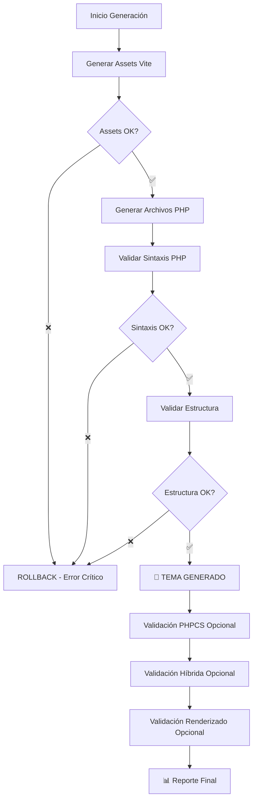

# Estrategia de Validaciones del Generador WordPress

## 📋 Resumen

El generador WordPress implementa un **sistema de validaciones escalonadas** que distingue entre validaciones **críticas** (que bloquean la generación) y **opcionales** (que solo emiten advertencias).

## 🎯 Filosofía de Validación

### ✅ **Generación Exitosa Garantizada**
- **Principio**: Si la sintaxis es válida y la estructura básica es correcta, el tema se genera
- **Beneficio**: No se pierde trabajo válido por validaciones de optimización
- **Resultado**: Desarrolladores obtienen feedback constructivo sin rollbacks destructivos

### ⚠️ **Validaciones Informativas**
- **Principio**: Las validaciones de calidad informan pero no bloquean
- **Beneficio**: Progreso incremental hacia la excelencia
- **Resultado**: Mejoras graduales sin frustraciones

## 🔧 Tipos de Validaciones

### 1. **🚨 VALIDACIONES CRÍTICAS** (Bloquean generación)

#### **Sintaxis PHP** ✅ Implementada
```bash
# Comando: php -l [archivo]
# Resultado: ❌ Error → Rollback inmediato
```
- **Propósito**: Garantizar que todos los archivos PHP son sintácticamente válidos
- **Criterio de falla**: Cualquier error de sintaxis PHP
- **Acción**: Rollback completo - no se genera tema
- **Justificación**: Un tema con errores de sintaxis no funciona en WordPress

#### **Estructura de Archivos** ✅ Implementada
```bash
# Validación de archivos obligatorios
- functions.php
- style.css
- index.php
- header.php
- footer.php
```
- **Propósito**: Garantizar estructura mínima de tema WordPress
- **Criterio de falla**: Archivos obligatorios faltantes
- **Acción**: Rollback completo
- **Justificación**: WordPress requiere estos archivos para funcionar

#### **Generación de Assets** ✅ Implementada
```bash
# Comando: npm run build
# Resultado: ❌ Error → Rollback inmediato
```
- **Propósito**: Garantizar que los assets se compilan correctamente
- **Criterio de falla**: Vite build falla
- **Acción**: Rollback completo
- **Justificación**: Sin assets, el tema no tiene estilos ni funcionalidad

### 2. **⚠️ VALIDACIONES OPCIONALES** (Solo informan)

#### **WordPress Coding Standards (PHPCS)** ✅ Implementada
```bash
# Comando: npm run wp:lint:fix
# Resultado: ⚠️ Advertencia → Tema generado
```
- **Propósito**: Mejorar calidad del código
- **Criterio de falla**: Errores de estilo detectados
- **Acción**: Auto-fix cuando es posible, advertencia si no
- **Justificación**: El código funciona, solo necesita mejoras de estilo

#### **Validación Híbrida** ✅ Implementada
```bash
# Comando: npm run wp:validate
# Resultado: ⚠️ Advertencia → Tema generado
```
- **Propósito**: Validar managers y herramientas profesionales
- **Criterio de falla**: Managers no alcanzan 100% éxito
- **Acción**: Advertencia con detalles específicos
- **Justificación**: Funcionalidad básica vs optimizaciones avanzadas

#### **Renderizado de Componentes** ✅ Implementada
```bash
# Comando: npm run wp:validate:render
# Resultado: ⚠️ Advertencia → Tema generado
```
- **Propósito**: Verificar que componentes renderizan correctamente
- **Criterio de falla**: Componentes no se renderizan como esperado
- **Acción**: Advertencia con componentes problemáticos
- **Justificación**: Tema funcional vs renderizado perfecto

## 🎯 Flujo de Validación Implementado



## 📊 Configuración de Validaciones

### **Variables de Control**
```javascript
// En scripts/wp-generator/index.js
const validationConfig = {
  // Críticas (bloquean)
  phpSyntax: true,          // Siempre obligatoria
  assetGeneration: true,    // Siempre obligatoria
  fileStructure: true,      // Siempre obligatoria

  // Opcionales (informan)
  phpcs: !process.env.SKIP_PHPCS,
  hybridValidation: true,   // Ahora es opcional
  componentRendering: true  // Ahora es opcional
};
```

### **Comandos de Ejecución**
```bash
# Generación completa con todas las validaciones
npm run wp:generate

# Generación rápida sin PHPCS
npm run wp:generate:fast

# Solo validaciones (sin generación)
npm run wp:validate

# Solo validación de componentes
npm run wp:validate:render
```

## 🔍 Detalles de Implementación

### **Manejo de Errores Escalonado**
```javascript
// Validaciones críticas
try {
  await this.validatePHPSyntax();
  await this.validateFileStructure();
  await this.buildAssets();
} catch (error) {
  // ROLLBACK INMEDIATO
  this.rollbackGeneration();
  throw error;
}

// Validaciones opcionales
try {
  await this.runOptionalValidations();
} catch (error) {
  // SOLO ADVERTENCIA
  console.log('⚠️ VALIDACIONES OPCIONALES:', error.message);
}
```

### **Reportes Informativos**
```javascript
// Reporte final siempre positivo si básico funciona
console.log('✅ Tema WordPress completo generado exitosamente!');
console.log('🎯 Características incluidas:');
console.log('   - ✅ CSS separados por componente (sin inline styles)');
console.log('   - ✅ Enqueue de assets optimizados por Vite');
// ... más características

// Validaciones opcionales como información adicional
if (optionalValidationsFailed) {
  console.log('\n⚠️ Validaciones opcionales para mejorar:');
  console.log('   • Ejecuta `npm run wp:validate` para optimizar');
}
```

## 🎯 Criterios de Éxito

### **✅ Mínimo Viable (Siempre alcanzable)**
1. ✅ **Sintaxis PHP válida** - Todos los archivos sin errores
2. ✅ **Assets generados** - CSS y JS compilados correctamente
3. ✅ **Estructura WordPress** - Archivos obligatorios presentes
4. ✅ **Seguridad básica** - Escape de datos implementado

### **🚀 Calidad Profesional (Objetivo aspiracional)**
1. ⚠️ **PHPCS 100%** - WordPress Coding Standards perfectos
2. ⚠️ **Validación híbrida** - Todos los managers funcionando
3. ⚠️ **Renderizado perfecto** - Componentes sin problemas
4. ⚠️ **Performance óptima** - Lighthouse scores altos

## 📈 Beneficios de esta Estrategia

### **1. Productividad Mejorada**
- ✅ **No más rollbacks destructivos** por validaciones menores
- ✅ **Progreso incremental** hacia la calidad
- ✅ **Feedback constructivo** en lugar de bloqueos

### **2. Experiencia de Desarrollo**
- ✅ **Menos frustración** - el trabajo válido no se pierde
- ✅ **Objetivos claros** - distingue entre crítico y opcional
- ✅ **Mejora gradual** - calidad como proceso, no como barrera

### **3. Calidad Escalable**
- ✅ **Base sólida garantizada** - funcionalidad nunca comprometida
- ✅ **Optimizaciones progresivas** - mejoras sin presión
- ✅ **Métricas claras** - saber exactamente qué mejorar

## 🔧 Mantenimiento del Sistema

### **Agregar Nueva Validación**
```javascript
// 1. Identificar tipo
const isOptional = !criticalForWordPressFunctionality;

// 2. Implementar según tipo
if (isOptional) {
  // Validación opcional - solo advierte
  try {
    await newValidation();
  } catch (error) {
    console.log('⚠️ VALIDACIÓN OPCIONAL:', error.message);
  }
} else {
  // Validación crítica - puede hacer rollback
  await newValidation(); // Throw si falla
}
```

### **Modificar Criterios**
```javascript
// En config/validation-thresholds.js
module.exports = {
  phpcs: {
    maxErrors: 0,        // Crítico si > 0
    maxWarnings: 50      // Opcional si <= 50
  },
  lighthouse: {
    minPerformance: 80,  // Opcional si < 80
    minSEO: 90          // Opcional si < 90
  }
};
```

---

## 📚 Documentación Relacionada

- **Comandos**: Ver `package.json` para todos los comandos disponibles
- **Configuración**: Ver `scripts/wp-generator/core/config.js`
- **Extensiones**: Ver `scripts/wp-generator/extensions/` para validaciones personalizadas

**✅ Resultado**: Sistema robusto que garantiza funcionalidad básica mientras aspira a la excelencia.